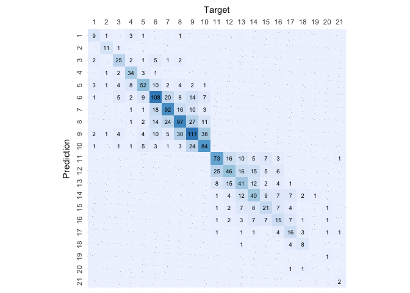

# Classification with Bagging

``` r
# Load libraries
library(ipred)
library(caret)
```

    ## Loading required package: ggplot2

    ## Loading required package: lattice

``` r
# Load helpers
source("./../helpers/helper.R")
```

## Import Data

``` r
# Read training and testing data
train <- read.csv("./../data/classification_data/intermediates/train.csv")
test <- read.csv("./../data/classification_data/intermediates/test.csv")
```

## Model Training

``` r
# Model training
bag.model = bagging(as.factor(Rating)~., data=train)
bag.model
```

    ## 
    ## Bagging classification trees with 25 bootstrap replications 
    ## 
    ## Call: bagging.data.frame(formula = as.factor(Rating) ~ ., data = train)

## Model Validation

``` r
# Predict the samples from test data using the model
result <- predict(bag.model, test, type="class")

# Print the Confusion matrix
confusion.matrix <- confusionMatrix(as.factor(result), as.factor(test$Rating))
plot.custom.confusion.matrix(confusion.matrix$table)
```

<!-- -->

``` r
# Print the accuracy stats of the model
data.frame(confusion.matrix$overall)
```

    ##                confusion.matrix.overall
    ## Accuracy                      0.5811248
    ## Kappa                         0.5455917
    ## AccuracyLower                 0.5560813
    ## AccuracyUpper                 0.6058597
    ## AccuracyNull                  0.1215255
    ## AccuracyPValue                0.0000000
    ## McnemarPValue                       NaN

``` r
# Print validation stats of the model
data.frame(confusion.matrix$byClass)
```

    ##           Sensitivity Specificity Pos.Pred.Value Neg.Pred.Value Precision
    ## Class: 1    0.5555556   0.9960759      0.6250000      0.9947747 0.6250000
    ## Class: 2    0.7333333   0.9993473      0.9166667      0.9973941 0.9166667
    ## Class: 3    0.5952381   0.9920266      0.6756757      0.9887417 0.6756757
    ## Class: 4    0.6346154   0.9946488      0.8048780      0.9873838 0.8048780
    ## Class: 5    0.7051282   0.9734513      0.5851064      0.9841707 0.5851064
    ## Class: 6    0.6272189   0.9499274      0.6057143      0.9540816 0.6057143
    ## Class: 7    0.6344828   0.9686163      0.6764706      0.9624380 0.6764706
    ## Class: 8    0.6024845   0.9458874      0.5639535      0.9534545 0.5639535
    ## Class: 9    0.5797872   0.9381898      0.5647668      0.9416544 0.5647668
    ## Class: 10   0.6319444   0.9679259      0.6691176      0.9624380 0.6691176
    ## Class: 11   0.6545455   0.9749478      0.6666667      0.9735928 0.6666667
    ## Class: 12   0.5529412   0.9582763      0.4351852      0.9735928 0.4351852
    ## Class: 13   0.4395604   0.9677198      0.4597701      0.9650685 0.4597701
    ## Class: 14   0.5000000   0.9691570      0.4943820      0.9698217 0.4943820
    ## Class: 15   0.4705882   0.9826203      0.4800000      0.9819639 0.4800000
    ## Class: 16   0.3260870   0.9806795      0.3409091      0.9793746 0.3409091
    ## Class: 17   0.4250000   0.9913736      0.5666667      0.9848385 0.5666667
    ## Class: 18   0.6000000   0.9973890      0.6923077      0.9960887 0.6923077
    ## Class: 19   0.0000000   0.9993532      0.0000000      0.9993532 0.0000000
    ## Class: 20   0.0000000   0.9980557      0.0000000      0.9974093 0.0000000
    ## Class: 21   0.5000000   1.0000000      1.0000000      0.9987055 1.0000000
    ##              Recall        F1   Prevalence Detection.Rate Detection.Prevalence
    ## Class: 1  0.5555556 0.5882353 0.0116354234    0.006464124         0.0103425986
    ## Class: 2  0.7333333 0.8148148 0.0096961862    0.007110537         0.0077569489
    ## Class: 3  0.5952381 0.6329114 0.0271493213    0.016160310         0.0239172592
    ## Class: 4  0.6346154 0.7096774 0.0336134454    0.021331610         0.0265029089
    ## Class: 5  0.7051282 0.6395349 0.0504201681    0.035552683         0.0607627666
    ## Class: 6  0.6272189 0.6162791 0.1092436975    0.068519716         0.1131221719
    ## Class: 7  0.6344828 0.6548043 0.0937297996    0.059469942         0.0879120879
    ## Class: 8  0.6024845 0.5825826 0.1040723982    0.062702004         0.1111829347
    ## Class: 9  0.5797872 0.5721785 0.1215255333    0.070458953         0.1247575953
    ## Class: 10 0.6319444 0.6500000 0.0930833872    0.058823529         0.0879120879
    ## Class: 11 0.6545455 0.6605505 0.0711053652    0.046541694         0.0698125404
    ## Class: 12 0.5529412 0.4870466 0.0549450549    0.030381383         0.0698125404
    ## Class: 13 0.4395604 0.4494382 0.0588235294    0.025856496         0.0562378798
    ## Class: 14 0.5000000 0.4971751 0.0568842922    0.028442146         0.0575307046
    ## Class: 15 0.4705882 0.4752475 0.0329670330    0.015513898         0.0323206206
    ## Class: 16 0.3260870 0.3333333 0.0297349709    0.009696186         0.0284421461
    ## Class: 17 0.4250000 0.4857143 0.0258564964    0.010989011         0.0193923723
    ## Class: 18 0.6000000 0.6428571 0.0096961862    0.005817712         0.0084033613
    ## Class: 19 0.0000000       NaN 0.0006464124    0.000000000         0.0006464124
    ## Class: 20 0.0000000       NaN 0.0025856496    0.000000000         0.0019392372
    ## Class: 21 0.5000000 0.6666667 0.0025856496    0.001292825         0.0012928248
    ##           Balanced.Accuracy
    ## Class: 1          0.7758157
    ## Class: 2          0.8663403
    ## Class: 3          0.7936323
    ## Class: 4          0.8146321
    ## Class: 5          0.8392898
    ## Class: 6          0.7885732
    ## Class: 7          0.8015495
    ## Class: 8          0.7741860
    ## Class: 9          0.7589885
    ## Class: 10         0.7999352
    ## Class: 11         0.8147466
    ## Class: 12         0.7556088
    ## Class: 13         0.7036401
    ## Class: 14         0.7345785
    ## Class: 15         0.7266043
    ## Class: 16         0.6533833
    ## Class: 17         0.7081868
    ## Class: 18         0.7986945
    ## Class: 19         0.4996766
    ## Class: 20         0.4990279
    ## Class: 21         0.7500000

``` r
# Get the feature importance
varImp(bag.model)
```

    ##                                                     Overall
    ## Asset.Turnover                                   1275.13364
    ## Binary.Rating                                     403.09330
    ## Current.Ratio                                    1593.55799
    ## Debt.Equity.Ratio                                1397.40005
    ## Free.Cash.Flow.Per.Share                          921.54840
    ## Gross.Margin                                     1471.33770
    ## Long.term.Debt...Capital                         1576.21702
    ## Net.Profit.Margin                                1380.38981
    ## Operating.Cash.Flow.Per.Share                     953.76499
    ## Rating.Agency_Egan.Jones.Ratings.Company          228.50127
    ## Rating.Agency_Fitch.Ratings                       170.44046
    ## Rating.Agency_Moody.s.Investors.Service           322.90441
    ## Rating.Agency_Standard...Poor.s.Ratings.Services  383.66563
    ## Return.On.Tangible.Equity                        1121.36180
    ## ROA...Return.On.Assets                           1174.86250
    ## ROE...Return.On.Equity                           1230.79814
    ## ROI...Return.On.Investment                       1102.24665
    ## Sector_BusEq                                      211.14443
    ## Sector_Chems                                      100.97599
    ## Sector_Durbl                                       79.85327
    ## Sector_Enrgy                                      160.43665
    ## Sector_Hlth                                       196.03774
    ## Sector_Manuf                                      175.57747
    ## Sector_Money                                       68.57102
    ## Sector_NoDur                                      124.83328
    ## Sector_Other                                      228.25131
    ## Sector_Shops                                      161.27477
    ## Sector_Telcm                                       90.16378
    ## Sector_Utils                                      106.88460
    ## X                                                2062.06873
    ## X.1                                              2244.22889

``` r
algorithm <- "Classification.with.Bagging"
save.class.acc.result(confusion.matrix$overall, algorithm)
save.class.pvv.result(confusion.matrix$byClass, algorithm)
```
