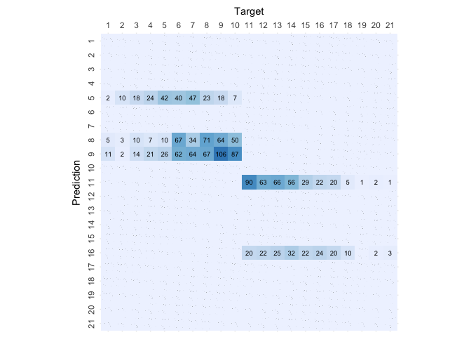

# Decision Tree

``` r
# Load libraries
library(rpart)
library(caret)
```

    ## Loading required package: ggplot2

    ## Loading required package: lattice

``` r
library(knitr)

# Load helpers
source("./../helpers/helper.R")
```

## Import Data

``` r
# Read training and testing data
train <- read.csv("./../data/classification_data/intermediates/train.csv")
test <- read.csv("./../data/classification_data/intermediates/test.csv")
```

## Model Training

``` r
dtree.model <- rpart(Rating~., data=train, method = 'class')
```

## Model Validation

``` r
# Predict the output for samples in test data using the model
result <- predict(dtree.model, test, type="class")

# Print the Confusion matrix
confusion.matrix <- confusionMatrix(as.factor(result), as.factor(test$Rating))
plot.custom.confusion.matrix(confusion.matrix$table)
```

<!-- -->

``` r
# Print the accuracy stats of the model
kable(data.frame(confusion.matrix$overall))
```

|                | confusion.matrix.overall |
|:---------------|-------------------------:|
| Accuracy       |                0.2152553 |
| Kappa          |                0.1423218 |
| AccuracyLower  |                0.1950072 |
| AccuracyUpper  |                0.2365900 |
| AccuracyNull   |                0.1215255 |
| AccuracyPValue |                0.0000000 |
| McnemarPValue  |                      NaN |

``` r
# Print validation stats of the model
kable(data.frame(confusion.matrix$byClass))
```

|           | Sensitivity | Specificity | Pos.Pred.Value | Neg.Pred.Value | Precision |    Recall |        F1 | Prevalence | Detection.Rate | Detection.Prevalence | Balanced.Accuracy |
|:----------|------------:|------------:|---------------:|---------------:|----------:|----------:|----------:|-----------:|---------------:|---------------------:|------------------:|
| Class: 1  |   0.0000000 |   1.0000000 |            NaN |      0.9883646 |        NA | 0.0000000 |        NA |  0.0116354 |      0.0000000 |            0.0000000 |         0.5000000 |
| Class: 2  |   0.0000000 |   1.0000000 |            NaN |      0.9903038 |        NA | 0.0000000 |        NA |  0.0096962 |      0.0000000 |            0.0000000 |         0.5000000 |
| Class: 3  |   0.0000000 |   1.0000000 |            NaN |      0.9728507 |        NA | 0.0000000 |        NA |  0.0271493 |      0.0000000 |            0.0000000 |         0.5000000 |
| Class: 4  |   0.0000000 |   1.0000000 |            NaN |      0.9663866 |        NA | 0.0000000 |        NA |  0.0336134 |      0.0000000 |            0.0000000 |         0.5000000 |
| Class: 5  |   0.5384615 |   0.8713410 |      0.1818182 |      0.9726444 | 0.1818182 | 0.5384615 | 0.2718447 |  0.0504202 |      0.0271493 |            0.1493213 |         0.7049013 |
| Class: 6  |   0.0000000 |   1.0000000 |            NaN |      0.8907563 |        NA | 0.0000000 |        NA |  0.1092437 |      0.0000000 |            0.0000000 |         0.5000000 |
| Class: 7  |   0.0000000 |   1.0000000 |            NaN |      0.9062702 |        NA | 0.0000000 |        NA |  0.0937298 |      0.0000000 |            0.0000000 |         0.5000000 |
| Class: 8  |   0.4409938 |   0.8196248 |      0.2211838 |      0.9265905 | 0.2211838 | 0.4409938 | 0.2946058 |  0.1040724 |      0.0458953 |            0.2074984 |         0.6303093 |
| Class: 9  |   0.5638298 |   0.7395143 |      0.2304348 |      0.9245630 | 0.2304348 | 0.5638298 | 0.3271605 |  0.1215255 |      0.0685197 |            0.2973497 |         0.6516721 |
| Class: 10 |   0.0000000 |   1.0000000 |            NaN |      0.9069166 |        NA | 0.0000000 |        NA |  0.0930834 |      0.0000000 |            0.0000000 |         0.5000000 |
| Class: 11 |   0.8181818 |   0.8155880 |      0.2535211 |      0.9832215 | 0.2535211 | 0.8181818 | 0.3870968 |  0.0711054 |      0.0581771 |            0.2294764 |         0.8168849 |
| Class: 12 |   0.0000000 |   1.0000000 |            NaN |      0.9450549 |        NA | 0.0000000 |        NA |  0.0549451 |      0.0000000 |            0.0000000 |         0.5000000 |
| Class: 13 |   0.0000000 |   1.0000000 |            NaN |      0.9411765 |        NA | 0.0000000 |        NA |  0.0588235 |      0.0000000 |            0.0000000 |         0.5000000 |
| Class: 14 |   0.0000000 |   1.0000000 |            NaN |      0.9431157 |        NA | 0.0000000 |        NA |  0.0568843 |      0.0000000 |            0.0000000 |         0.5000000 |
| Class: 15 |   0.0000000 |   1.0000000 |            NaN |      0.9670330 |        NA | 0.0000000 |        NA |  0.0329670 |      0.0000000 |            0.0000000 |         0.5000000 |
| Class: 16 |   0.5217391 |   0.8960693 |      0.1333333 |      0.9839064 | 0.1333333 | 0.5217391 | 0.2123894 |  0.0297350 |      0.0155139 |            0.1163542 |         0.7089042 |
| Class: 17 |   0.0000000 |   1.0000000 |            NaN |      0.9741435 |        NA | 0.0000000 |        NA |  0.0258565 |      0.0000000 |            0.0000000 |         0.5000000 |
| Class: 18 |   0.0000000 |   1.0000000 |            NaN |      0.9903038 |        NA | 0.0000000 |        NA |  0.0096962 |      0.0000000 |            0.0000000 |         0.5000000 |
| Class: 19 |   0.0000000 |   1.0000000 |            NaN |      0.9993536 |        NA | 0.0000000 |        NA |  0.0006464 |      0.0000000 |            0.0000000 |         0.5000000 |
| Class: 20 |   0.0000000 |   1.0000000 |            NaN |      0.9974144 |        NA | 0.0000000 |        NA |  0.0025856 |      0.0000000 |            0.0000000 |         0.5000000 |
| Class: 21 |   0.0000000 |   1.0000000 |            NaN |      0.9974144 |        NA | 0.0000000 |        NA |  0.0025856 |      0.0000000 |            0.0000000 |         0.5000000 |

``` r
# Get the feature importance
kable(varImp(dtree.model))
```

|                                                |   Overall |
|:-----------------------------------------------|----------:|
| Binary.Rating                                  | 402.87393 |
| Current.Ratio                                  |  49.15919 |
| Debt.Equity.Ratio                              |  19.70241 |
| Gross.Margin                                   |  14.30447 |
| Long.term.Debt…Capital                         |  47.04949 |
| Net.Profit.Margin                              | 160.94021 |
| Rating.Agency_Egan.Jones.Ratings.Company       |  34.93583 |
| Rating.Agency_Standard…Poor.s.Ratings.Services |  14.02433 |
| ROA…Return.On.Assets                           | 150.01821 |
| ROE…Return.On.Equity                           |  94.20814 |
| ROI…Return.On.Investment                       | 150.16250 |
| Sector_Hlth                                    |  14.05407 |
| X.1                                            |   0.00000 |
| X                                              |   0.00000 |
| Rating.Agency_Fitch.Ratings                    |   0.00000 |
| Rating.Agency_Moody.s.Investors.Service        |   0.00000 |
| Sector_BusEq                                   |   0.00000 |
| Sector_Chems                                   |   0.00000 |
| Sector_Durbl                                   |   0.00000 |
| Sector_Enrgy                                   |   0.00000 |
| Sector_Manuf                                   |   0.00000 |
| Sector_Money                                   |   0.00000 |
| Sector_NoDur                                   |   0.00000 |
| Sector_Other                                   |   0.00000 |
| Sector_Shops                                   |   0.00000 |
| Sector_Telcm                                   |   0.00000 |
| Sector_Utils                                   |   0.00000 |
| Asset.Turnover                                 |   0.00000 |
| Return.On.Tangible.Equity                      |   0.00000 |
| Operating.Cash.Flow.Per.Share                  |   0.00000 |
| Free.Cash.Flow.Per.Share                       |   0.00000 |

``` r
# Save the results
algorithm <- "Decision.Tree"
save.class.acc.result(confusion.matrix$overall, algorithm)
save.class.pvv.result(confusion.matrix$byClass, algorithm)
```
