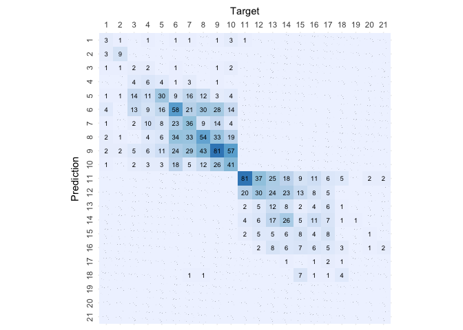

# Gradient Boosting

``` r
# Load libraries
library(gbm)
```

    ## Loaded gbm 2.1.8

``` r
library(caret)
```

    ## Loading required package: ggplot2

    ## Loading required package: lattice

``` r
library(knitr)

# Load helpers
source("./../helpers/helper.R")
```

## Import Data

``` r
# Read training and testing data
train <- read.csv("./../data/classification_data/intermediates/train.csv")
test <- read.csv("./../data/classification_data/intermediates/test.csv")

# Drop index columns
drops <- c("X.1", "X")
train <- train[, !(names(train) %in% drops)]
test <- test[, !(names(test) %in% drops)]
```

## Model Training

``` r
# Train the model
gbm.model = gbm(as.factor(Rating)~., data=train, distribution = "multinomial")
```

    ## Warning: Setting `distribution = "multinomial"` is ill-advised as it is
    ## currently broken. It exists only for backwards compatibility. Use at your own
    ## risk.

``` r
gbm.model
```

    ## gbm(formula = as.factor(Rating) ~ ., distribution = "multinomial", 
    ##     data = train)
    ## A gradient boosted model with multinomial loss function.
    ## 100 iterations were performed.
    ## There were 29 predictors of which 29 had non-zero influence.

``` r
# Predict the samples from test data using the model
result <- predict(gbm.model, test)
```

    ## Using 100 trees...

``` r
# Find the classes from the prediction probabilities
final.result = colnames(result)[apply(result,1,which.max)]

# Print the Confusion matrix
confusion.matrix <- confusionMatrix(as.factor(final.result), as.factor(test$Rating))
```

    ## Warning in levels(reference) != levels(data): longer object length is not a
    ## multiple of shorter object length

    ## Warning in confusionMatrix.default(as.factor(final.result),
    ## as.factor(test$Rating)): Levels are not in the same order for reference and
    ## data. Refactoring data to match.

``` r
plot.custom.confusion.matrix(confusion.matrix$table)
```

<!-- -->

``` r
# Print the accuracy stats of the model
kable(data.frame(confusion.matrix$overall))
```

|                | confusion.matrix.overall |
|:---------------|-------------------------:|
| Accuracy       |                0.3160957 |
| Kappa          |                0.2539352 |
| AccuracyLower  |                0.2929706 |
| AccuracyUpper  |                0.3399209 |
| AccuracyNull   |                0.1215255 |
| AccuracyPValue |                0.0000000 |
| McnemarPValue  |                      NaN |

``` r
# Print validation stats of the model
kable(data.frame(confusion.matrix$byClass))
```

|           | Sensitivity | Specificity | Pos.Pred.Value | Neg.Pred.Value | Precision |    Recall |        F1 | Prevalence | Detection.Rate | Detection.Prevalence | Balanced.Accuracy |
|:----------|------------:|------------:|---------------:|---------------:|----------:|----------:|----------:|-----------:|---------------:|---------------------:|------------------:|
| Class: 1  |   0.1666667 |   0.9941138 |      0.2500000 |      0.9902280 | 0.2500000 | 0.1666667 | 0.2000000 |  0.0116354 |      0.0019392 |            0.0077569 |         0.5803902 |
| Class: 2  |   0.6000000 |   0.9980418 |      0.7500000 |      0.9960912 | 0.7500000 | 0.6000000 | 0.6666667 |  0.0096962 |      0.0058177 |            0.0077569 |         0.7990209 |
| Class: 3  |   0.0476190 |   0.9946844 |      0.2000000 |      0.9739753 | 0.2000000 | 0.0476190 | 0.0769231 |  0.0271493 |      0.0012928 |            0.0064641 |         0.5211517 |
| Class: 4  |   0.1153846 |   0.9913043 |      0.3157895 |      0.9698953 | 0.3157895 | 0.1153846 | 0.1690141 |  0.0336134 |      0.0038785 |            0.0122818 |         0.5533445 |
| Class: 5  |   0.3846154 |   0.9516678 |      0.2970297 |      0.9668050 | 0.2970297 | 0.3846154 | 0.3351955 |  0.0504202 |      0.0193924 |            0.0652877 |         0.6681416 |
| Class: 6  |   0.3431953 |   0.9020319 |      0.3005181 |      0.9180207 | 0.3005181 | 0.3431953 | 0.3204420 |  0.1092437 |      0.0374919 |            0.1247576 |         0.6226136 |
| Class: 7  |   0.2482759 |   0.9493581 |      0.3364486 |      0.9243056 | 0.3364486 | 0.2482759 | 0.2857143 |  0.0937298 |      0.0232708 |            0.0691661 |         0.5988170 |
| Class: 8  |   0.3354037 |   0.9047619 |      0.2903226 |      0.9213813 | 0.2903226 | 0.3354037 | 0.3112392 |  0.1040724 |      0.0349063 |            0.1202327 |         0.6200828 |
| Class: 9  |   0.4308511 |   0.8682855 |      0.3115385 |      0.9168609 | 0.3115385 | 0.4308511 | 0.3616071 |  0.1215255 |      0.0523594 |            0.1680672 |         0.6495683 |
| Class: 10 |   0.2847222 |   0.9501069 |      0.3693694 |      0.9282730 | 0.3693694 | 0.2847222 | 0.3215686 |  0.0930834 |      0.0265029 |            0.0717518 |         0.6174146 |
| Class: 11 |   0.7363636 |   0.9199722 |      0.4132653 |      0.9785344 | 0.4132653 | 0.7363636 | 0.5294118 |  0.0711054 |      0.0523594 |            0.1266968 |         0.8281679 |
| Class: 12 |   0.3529412 |   0.9363885 |      0.2439024 |      0.9613764 | 0.2439024 | 0.3529412 | 0.2884615 |  0.0549451 |      0.0193924 |            0.0795087 |         0.6446648 |
| Class: 13 |   0.1318681 |   0.9807692 |      0.3000000 |      0.9475780 | 0.3000000 | 0.1318681 | 0.1832061 |  0.0588235 |      0.0077569 |            0.0258565 |         0.5563187 |
| Class: 14 |   0.2954545 |   0.9643592 |      0.3333333 |      0.9577944 | 0.3333333 | 0.2954545 | 0.3132530 |  0.0568843 |      0.0168067 |            0.0504202 |         0.6299068 |
| Class: 15 |   0.1568627 |   0.9792781 |      0.2051282 |      0.9714854 | 0.2051282 | 0.1568627 | 0.1777778 |  0.0329670 |      0.0051713 |            0.0252101 |         0.5680704 |
| Class: 16 |   0.1304348 |   0.9773484 |      0.1500000 |      0.9734572 | 0.1500000 | 0.1304348 | 0.1395349 |  0.0297350 |      0.0038785 |            0.0258565 |         0.5538916 |
| Class: 17 |   0.0500000 |   0.9980093 |      0.4000000 |      0.9753567 | 0.4000000 | 0.0500000 | 0.0888889 |  0.0258565 |      0.0012928 |            0.0032321 |         0.5240046 |
| Class: 18 |   0.2666667 |   0.9928198 |      0.2666667 |      0.9928198 | 0.2666667 | 0.2666667 | 0.2666667 |  0.0096962 |      0.0025856 |            0.0096962 |         0.6297433 |
| Class: 19 |   0.0000000 |   1.0000000 |            NaN |      0.9993536 |        NA | 0.0000000 |        NA |  0.0006464 |      0.0000000 |            0.0000000 |         0.5000000 |
| Class: 20 |   0.0000000 |   1.0000000 |            NaN |      0.9974144 |        NA | 0.0000000 |        NA |  0.0025856 |      0.0000000 |            0.0000000 |         0.5000000 |
| Class: 21 |   0.0000000 |   1.0000000 |            NaN |      0.9974144 |        NA | 0.0000000 |        NA |  0.0025856 |      0.0000000 |            0.0000000 |         0.5000000 |

``` r
# Save the results
algorithm <- "Gradient.Boosting"
save.class.acc.result(confusion.matrix$overall, algorithm)
save.class.pvv.result(confusion.matrix$byClass, algorithm)
```

## Prediction with Unknown Data

``` r
# Load the data
unk <- read.csv("./../data/classification_data/intermediates/unknown_data.csv")
```

    ## Warning in read.table(file = file, header = header, sep = sep, quote =
    ## quote, : incomplete final line found by readTableHeader on './../data/
    ## classification_data/intermediates/unknown_data.csv'

``` r
dim(unk)
```

    ## [1]  1 29

``` r
# Predict using the built model
prediction <- predict(gbm.model, unk)
```

    ## Using 100 trees...

``` r
final.pred = colnames(result)[apply(prediction,1,which.max)]
final.pred
```

    ## [1] "10"
