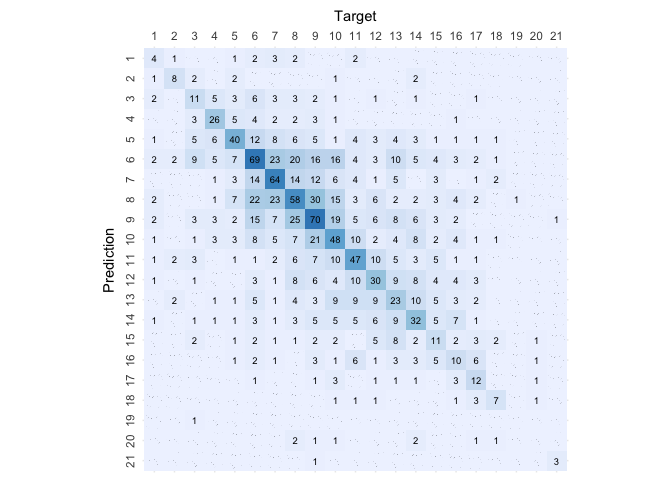

# kNN

``` r
# Load libraries
library(e1071)
library(caret)
```

    ## Loading required package: ggplot2

    ## Loading required package: lattice

``` r
library(knitr)

# Load helpers
source("./../helpers/helper.R")
```

## Import Data

``` r
# Read training and testing data
train <- read.csv("./../data/classification_data/intermediates/train.csv")
test <- read.csv("./../data/classification_data/intermediates/test.csv")
```

## Model Training

``` r
ks <- c(3, 5, 9, 15, 23)
initial_accuracy <- 0
for (k in ks){
  print(k)
  knn.model <- knn3(as.factor(Rating)~., data=train, k=k)
  result <- predict(knn.model, test, type="class")
  sum(is.na(result))
  sum(is.na(test$Rating))
  accuracy <- mean(as.factor(result)==as.factor(test$Rating))
  print(accuracy)
  if (initial_accuracy < accuracy){
    initial_accuracy <- accuracy
    chosen_k <- k
  }
  print("\n")
}
```

    ## [1] 3
    ## [1] 0.376212
    ## [1] "\n"
    ## [1] 5
    ## [1] 0.2908856
    ## [1] "\n"
    ## [1] 9
    ## [1] 0.2301228
    ## [1] "\n"
    ## [1] 15
    ## [1] 0.1848739
    ## [1] "\n"
    ## [1] 23
    ## [1] 0.1648352
    ## [1] "\n"

``` r
print(chosen_k)
```

    ## [1] 3

``` r
# Retrain the model with chosen value of k
knn.model <- knn3(as.factor(Rating)~., data=train, k=chosen_k)
knn.model
```

    ## 3-nearest neighbor model
    ## Training set outcome distribution:
    ## 
    ##   1   2   3   4   5   6   7   8   9  10  11  12  13  14  15  16  17  18  19  20 
    ##  70  55 143 193 399 655 565 678 719 558 434 368 336 334 259 242 110  50   9  14 
    ##  21 
    ##   7

## Model Validation

``` r
# Use the new model for prediction
result <- predict(knn.model, test, type="class")

# Print the Confusion matrix
confusion.matrix <- confusionMatrix(as.factor(result), as.factor(test$Rating))
plot.custom.confusion.matrix(confusion.matrix$table)
```

<!-- -->

``` r
# Print the accuracy stats of the model
kable(data.frame(confusion.matrix$overall))
```

|                | confusion.matrix.overall |
|:---------------|-------------------------:|
| Accuracy       |                0.3703943 |
| Kappa          |                0.3171145 |
| AccuracyLower  |                0.3462723 |
| AccuracyUpper  |                0.3950095 |
| AccuracyNull   |                0.1215255 |
| AccuracyPValue |                0.0000000 |
| McnemarPValue  |                      NaN |

``` r
# Print validation stats of the model
kable(data.frame(confusion.matrix$byClass))
```

|           | Sensitivity | Specificity | Pos.Pred.Value | Neg.Pred.Value | Precision |    Recall |        F1 | Prevalence | Detection.Rate | Detection.Prevalence | Balanced.Accuracy |
|:----------|------------:|------------:|---------------:|---------------:|----------:|----------:|----------:|-----------:|---------------:|---------------------:|------------------:|
| Class: 1  |   0.2222222 |   0.9928058 |      0.2666667 |      0.9908616 | 0.2666667 | 0.2222222 | 0.2424242 |  0.0116354 |      0.0025856 |            0.0096962 |         0.6075140 |
| Class: 2  |   0.5333333 |   0.9947781 |      0.5000000 |      0.9954278 | 0.5000000 | 0.5333333 | 0.5161290 |  0.0096962 |      0.0051713 |            0.0103426 |         0.7640557 |
| Class: 3  |   0.2619048 |   0.9813953 |      0.2820513 |      0.9794430 | 0.2820513 | 0.2619048 | 0.2716049 |  0.0271493 |      0.0071105 |            0.0252101 |         0.6216501 |
| Class: 4  |   0.5000000 |   0.9859532 |      0.5531915 |      0.9826667 | 0.5531915 | 0.5000000 | 0.5252525 |  0.0336134 |      0.0168067 |            0.0303814 |         0.7429766 |
| Class: 5  |   0.5128205 |   0.9577944 |      0.3921569 |      0.9737024 | 0.3921569 | 0.5128205 | 0.4444444 |  0.0504202 |      0.0258565 |            0.0659341 |         0.7353075 |
| Class: 6  |   0.4082840 |   0.9042090 |      0.3432836 |      0.9257058 | 0.3432836 | 0.4082840 | 0.3729730 |  0.1092437 |      0.0446025 |            0.1299289 |         0.6562465 |
| Class: 7  |   0.4413793 |   0.9529244 |      0.4923077 |      0.9428370 | 0.4923077 | 0.4413793 | 0.4654545 |  0.0937298 |      0.0413704 |            0.0840336 |         0.6971519 |
| Class: 8  |   0.3602484 |   0.9112554 |      0.3204420 |      0.9245974 | 0.3204420 | 0.3602484 | 0.3391813 |  0.1040724 |      0.0374919 |            0.1170006 |         0.6357519 |
| Class: 9  |   0.3723404 |   0.9212656 |      0.3954802 |      0.9138686 | 0.3954802 | 0.3723404 | 0.3835616 |  0.1215255 |      0.0452489 |            0.1144150 |         0.6468030 |
| Class: 10 |   0.3333333 |   0.9422666 |      0.3720930 |      0.9322990 | 0.3720930 | 0.3333333 | 0.3516484 |  0.0930834 |      0.0310278 |            0.0833872 |         0.6378000 |
| Class: 11 |   0.4272727 |   0.9596381 |      0.4476190 |      0.9563107 | 0.4476190 | 0.4272727 | 0.4372093 |  0.0711054 |      0.0303814 |            0.0678733 |         0.6934554 |
| Class: 12 |   0.3529412 |   0.9575923 |      0.3260870 |      0.9621993 | 0.3260870 | 0.3529412 | 0.3389831 |  0.0549451 |      0.0193924 |            0.0594699 |         0.6552668 |
| Class: 13 |   0.2527473 |   0.9560440 |      0.2643678 |      0.9534247 | 0.2643678 | 0.2527473 | 0.2584270 |  0.0588235 |      0.0148675 |            0.0562379 |         0.6043956 |
| Class: 14 |   0.3636364 |   0.9629883 |      0.3720930 |      0.9616701 | 0.3720930 | 0.3636364 | 0.3678161 |  0.0568843 |      0.0206852 |            0.0555915 |         0.6633124 |
| Class: 15 |   0.2156863 |   0.9772727 |      0.2444444 |      0.9733688 | 0.2444444 | 0.2156863 | 0.2291667 |  0.0329670 |      0.0071105 |            0.0290886 |         0.5964795 |
| Class: 16 |   0.2173913 |   0.9780147 |      0.2325581 |      0.9760638 | 0.2325581 | 0.2173913 | 0.2247191 |  0.0297350 |      0.0064641 |            0.0277957 |         0.5977030 |
| Class: 17 |   0.3000000 |   0.9920372 |      0.5000000 |      0.9816152 | 0.5000000 | 0.3000000 | 0.3750000 |  0.0258565 |      0.0077569 |            0.0155139 |         0.6460186 |
| Class: 18 |   0.4666667 |   0.9947781 |      0.4666667 |      0.9947781 | 0.4666667 | 0.4666667 | 0.4666667 |  0.0096962 |      0.0045249 |            0.0096962 |         0.7307224 |
| Class: 19 |   0.0000000 |   0.9993532 |      0.0000000 |      0.9993532 | 0.0000000 | 0.0000000 |       NaN |  0.0006464 |      0.0000000 |            0.0006464 |         0.4996766 |
| Class: 20 |   0.0000000 |   0.9948153 |      0.0000000 |      0.9974009 | 0.0000000 | 0.0000000 |       NaN |  0.0025856 |      0.0000000 |            0.0051713 |         0.4974076 |
| Class: 21 |   0.7500000 |   0.9993519 |      0.7500000 |      0.9993519 | 0.7500000 | 0.7500000 | 0.7500000 |  0.0025856 |      0.0019392 |            0.0025856 |         0.8746760 |

``` r
# Save the results
algorithm <- "kNN"
save.class.acc.result(confusion.matrix$overall, algorithm)
save.class.pvv.result(confusion.matrix$byClass, algorithm)
```
