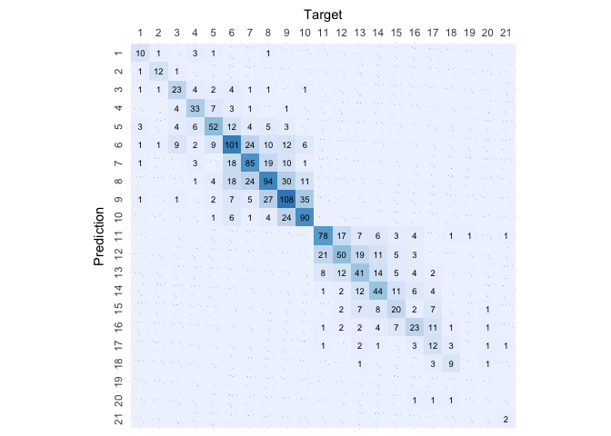

# Random Forest

``` r
# Load libraries
library(randomForest)
```

    ## randomForest 4.7-1.1

    ## Type rfNews() to see new features/changes/bug fixes.

``` r
library(caret)
```

    ## Loading required package: ggplot2

    ## 
    ## Attaching package: 'ggplot2'

    ## The following object is masked from 'package:randomForest':
    ## 
    ##     margin

    ## Loading required package: lattice

``` r
library(knitr)

# Load helpers
source("./../helpers/helper.R")
```

## Import Data

``` r
# Read training and testing data
train <- read.csv("./../data/classification_data/intermediates/train.csv")
test <- read.csv("./../data/classification_data/intermediates/test.csv")
```

## Model Training

``` r
# Model Training
rf.model <- randomForest(as.factor(Rating)~., data=train)
rf.model
```

    ## 
    ## Call:
    ##  randomForest(formula = as.factor(Rating) ~ ., data = train) 
    ##                Type of random forest: classification
    ##                      Number of trees: 500
    ## No. of variables tried at each split: 5
    ## 
    ##         OOB estimate of  error rate: 42.5%
    ## Confusion matrix:
    ##     1  2  3   4   5   6   7   8   9  10  11  12  13  14  15  16 17 18 19 20 21
    ## 1  42  2  9   2   4   5   4   0   2   0   0   0   0   0   0   0  0  0  0  0  0
    ## 2   1 49  0   3   1   0   0   1   0   0   0   0   0   0   0   0  0  0  0  0  0
    ## 3   6  3 74  11  15  18   4   1   6   5   0   0   0   0   0   0  0  0  0  0  0
    ## 4   2  3 15 119  24  15   9   3   2   1   0   0   0   0   0   0  0  0  0  0  0
    ## 5   4  0 10  25 281  35  18  11   9   6   0   0   0   0   0   0  0  0  0  0  0
    ## 6   4  1 17  10  40 399  69  60  42  13   0   0   0   0   0   0  0  0  0  0  0
    ## 7   5  0  5  14  21  80 330  79  21  10   0   0   0   0   0   0  0  0  0  0  0
    ## 8   1  1  1   4  12  60  65 412 106  16   0   0   0   0   0   0  0  0  0  0  0
    ## 9   0  1  1   1   5  52  19 110 437  93   0   0   0   0   0   0  0  0  0  0  0
    ## 10  0  0  0   0   3  15  18  29 126 366   1   0   0   0   0   0  0  0  0  0  0
    ## 11  0  0  0   0   0   0   0   0   0   0 283  86  31  20  10   3  0  0  0  1  0
    ## 12  0  0  0   0   0   0   0   0   0   0  87 168  54  37   8  11  3  0  0  0  0
    ## 13  0  0  0   0   0   0   0   0   0   0  34  64 161  46  14  12  5  0  0  0  0
    ## 14  0  0  0   0   0   0   0   0   0   0  21  38  50 158  42  23  1  1  0  0  0
    ## 15  0  0  0   0   0   0   0   0   0   0  16   6  18  56 111  40  8  2  0  2  0
    ## 16  0  0  0   0   0   0   0   0   0   0   5  15  15  30  41 114 16  6  0  0  0
    ## 17  0  0  0   0   0   0   0   0   0   0   3   4   6   8  14  22 38 15  0  0  0
    ## 18  0  0  0   0   0   0   0   0   0   0   1   1   1   3   4   7 13 16  1  2  1
    ## 19  0  0  0   0   0   0   0   0   0   0   0   1   0   0   3   0  2  2  0  1  0
    ## 20  0  0  0   0   0   0   0   0   0   0   0   0   0   0   1   0  2  4  2  4  1
    ## 21  0  0  0   0   0   0   0   0   0   0   0   0   0   0   0   0  1  3  0  1  2
    ##    class.error
    ## 1    0.4000000
    ## 2    0.1090909
    ## 3    0.4825175
    ## 4    0.3834197
    ## 5    0.2957393
    ## 6    0.3908397
    ## 7    0.4159292
    ## 8    0.3923304
    ## 9    0.3922114
    ## 10   0.3440860
    ## 11   0.3479263
    ## 12   0.5434783
    ## 13   0.5208333
    ## 14   0.5269461
    ## 15   0.5714286
    ## 16   0.5289256
    ## 17   0.6545455
    ## 18   0.6800000
    ## 19   1.0000000
    ## 20   0.7142857
    ## 21   0.7142857

## Model Validation

``` r
# Predict the samples from test data using the model
result <- predict(rf.model, test, type="class")

# Print the Confusion matrix
confusion.matrix <- confusionMatrix(as.factor(result), as.factor(test$Rating))
plot.custom.confusion.matrix(confusion.matrix$table)
```

<!-- -->

``` r
# Print the accuracy stats of the model
kable(data.frame(confusion.matrix$overall))
```

|                | confusion.matrix.overall |
|:---------------|-------------------------:|
| Accuracy       |                0.5875889 |
| Kappa          |                0.5526946 |
| AccuracyLower  |                0.5625882 |
| AccuracyUpper  |                0.6122565 |
| AccuracyNull   |                0.1215255 |
| AccuracyPValue |                0.0000000 |
| McnemarPValue  |                      NaN |

``` r
# Print validation stats of the model
kable(data.frame(confusion.matrix$byClass))
```

|           | Sensitivity | Specificity | Pos.Pred.Value | Neg.Pred.Value | Precision |    Recall |        F1 | Prevalence | Detection.Rate | Detection.Prevalence | Balanced.Accuracy |
|:----------|------------:|------------:|---------------:|---------------:|----------:|----------:|----------:|-----------:|---------------:|---------------------:|------------------:|
| Class: 1  |   0.6111111 |   0.9960759 |      0.6470588 |      0.9954248 | 0.6470588 | 0.6111111 | 0.6285714 |  0.0116354 |      0.0071105 |            0.0109890 |         0.8035935 |
| Class: 2  |   0.8000000 |   0.9986945 |      0.8571429 |      0.9980431 | 0.8571429 | 0.8000000 | 0.8275862 |  0.0096962 |      0.0077569 |            0.0090498 |         0.8993473 |
| Class: 3  |   0.5476190 |   0.9926910 |      0.6764706 |      0.9874422 | 0.6764706 | 0.5476190 | 0.6052632 |  0.0271493 |      0.0148675 |            0.0219780 |         0.7701550 |
| Class: 4  |   0.6730769 |   0.9926421 |      0.7608696 |      0.9886742 | 0.7608696 | 0.6730769 | 0.7142857 |  0.0336134 |      0.0226244 |            0.0297350 |         0.8328595 |
| Class: 5  |   0.7051282 |   0.9761743 |      0.6111111 |      0.9842141 | 0.6111111 | 0.7051282 | 0.6547619 |  0.0504202 |      0.0355527 |            0.0581771 |         0.8406512 |
| Class: 6  |   0.6331361 |   0.9462990 |      0.5911602 |      0.9546120 | 0.5911602 | 0.6331361 | 0.6114286 |  0.1092437 |      0.0691661 |            0.1170006 |         0.7897175 |
| Class: 7  |   0.6137931 |   0.9621969 |      0.6267606 |      0.9601423 | 0.6267606 | 0.6137931 | 0.6202091 |  0.0937298 |      0.0575307 |            0.0917906 |         0.7879950 |
| Class: 8  |   0.5776398 |   0.9451659 |      0.5502959 |      0.9506531 | 0.5502959 | 0.5776398 | 0.5636364 |  0.1040724 |      0.0601164 |            0.1092437 |         0.7614028 |
| Class: 9  |   0.5797872 |   0.9433407 |      0.5860215 |      0.9419544 | 0.5860215 | 0.5797872 | 0.5828877 |  0.1215255 |      0.0704590 |            0.1202327 |         0.7615640 |
| Class: 10 |   0.6388889 |   0.9707769 |      0.6917293 |      0.9632249 | 0.6917293 | 0.6388889 | 0.6642599 |  0.0930834 |      0.0594699 |            0.0859729 |         0.8048329 |
| Class: 11 |   0.7454545 |   0.9728601 |      0.6776860 |      0.9803647 | 0.6776860 | 0.7454545 | 0.7099567 |  0.0711054 |      0.0530058 |            0.0782159 |         0.8591573 |
| Class: 12 |   0.5882353 |   0.9630643 |      0.4807692 |      0.9757450 | 0.4807692 | 0.5882353 | 0.5291005 |  0.0549451 |      0.0323206 |            0.0672269 |         0.7756498 |
| Class: 13 |   0.4505495 |   0.9725275 |      0.5061728 |      0.9658936 | 0.5061728 | 0.4505495 | 0.4767442 |  0.0588235 |      0.0265029 |            0.0523594 |         0.7115385 |
| Class: 14 |   0.5000000 |   0.9739548 |      0.5365854 |      0.9699659 | 0.5365854 | 0.5000000 | 0.5176471 |  0.0568843 |      0.0284421 |            0.0530058 |         0.7369774 |
| Class: 15 |   0.4313725 |   0.9806150 |      0.4313725 |      0.9806150 | 0.4313725 | 0.4313725 | 0.4313725 |  0.0329670 |      0.0142211 |            0.0329670 |         0.7059938 |
| Class: 16 |   0.4130435 |   0.9813458 |      0.4042553 |      0.9820000 | 0.4042553 | 0.4130435 | 0.4086022 |  0.0297350 |      0.0122818 |            0.0303814 |         0.6971946 |
| Class: 17 |   0.3500000 |   0.9920372 |      0.5384615 |      0.9829060 | 0.5384615 | 0.3500000 | 0.4242424 |  0.0258565 |      0.0090498 |            0.0168067 |         0.6710186 |
| Class: 18 |   0.6000000 |   0.9941253 |      0.5000000 |      0.9960759 | 0.5000000 | 0.6000000 | 0.5454545 |  0.0096962 |      0.0058177 |            0.0116354 |         0.7970627 |
| Class: 19 |   0.0000000 |   1.0000000 |            NaN |      0.9993536 |        NA | 0.0000000 |        NA |  0.0006464 |      0.0000000 |            0.0000000 |         0.5000000 |
| Class: 20 |   0.0000000 |   0.9980557 |      0.0000000 |      0.9974093 | 0.0000000 | 0.0000000 |       NaN |  0.0025856 |      0.0000000 |            0.0019392 |         0.4990279 |
| Class: 21 |   0.5000000 |   1.0000000 |      1.0000000 |      0.9987055 | 1.0000000 | 0.5000000 | 0.6666667 |  0.0025856 |      0.0012928 |            0.0012928 |         0.7500000 |

``` r
# Get the feature importances for each feature
kable(varImp(rf.model))
```

|                                                |   Overall |
|:-----------------------------------------------|----------:|
| X.1                                            | 404.60009 |
| X                                              | 404.65910 |
| Rating.Agency_Egan.Jones.Ratings.Company       |  97.22570 |
| Rating.Agency_Fitch.Ratings                    |  39.24915 |
| Rating.Agency_Moody.s.Investors.Service        |  79.61568 |
| Rating.Agency_Standard…Poor.s.Ratings.Services |  94.45759 |
| Binary.Rating                                  | 364.62524 |
| Sector_BusEq                                   |  39.22891 |
| Sector_Chems                                   |  20.34368 |
| Sector_Durbl                                   |  14.47787 |
| Sector_Enrgy                                   |  30.09008 |
| Sector_Hlth                                    |  34.75426 |
| Sector_Manuf                                   |  36.36198 |
| Sector_Money                                   |  12.43197 |
| Sector_NoDur                                   |  23.39166 |
| Sector_Other                                   |  44.26294 |
| Sector_Shops                                   |  34.09704 |
| Sector_Telcm                                   |  18.83422 |
| Sector_Utils                                   |  22.95972 |
| Current.Ratio                                  | 316.38226 |
| Long.term.Debt…Capital                         | 306.88828 |
| Debt.Equity.Ratio                              | 290.66999 |
| Gross.Margin                                   | 311.27641 |
| Net.Profit.Margin                              | 299.35024 |
| Asset.Turnover                                 | 288.02938 |
| ROE…Return.On.Equity                           | 277.80058 |
| Return.On.Tangible.Equity                      | 279.74316 |
| ROA…Return.On.Assets                           | 287.27026 |
| ROI…Return.On.Investment                       | 285.89051 |
| Operating.Cash.Flow.Per.Share                  | 246.07496 |
| Free.Cash.Flow.Per.Share                       | 242.49873 |

``` r
# Save the results
algorithm <- "Random.Forest"
save.class.acc.result(confusion.matrix$overall, algorithm)
save.class.pvv.result(confusion.matrix$byClass, algorithm)
```
