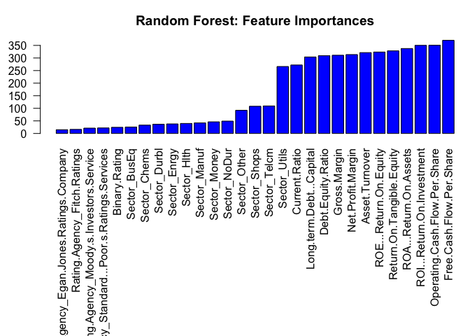

# Random Forest

``` r
# Load libraries
library(randomForest)
```

    ## randomForest 4.7-1.1

    ## Type rfNews() to see new features/changes/bug fixes.

``` r
library(caret)
```

    ## Loading required package: ggplot2

    ## 
    ## Attaching package: 'ggplot2'

    ## The following object is masked from 'package:randomForest':
    ## 
    ##     margin

    ## Loading required package: lattice

``` r
library(knitr)

# Load helpers
source("./../helpers/helper.R")
```

## Import Data

``` r
# Read training and testing data
train <- read.csv("./../data/classification_data/intermediates/train.csv")
test <- read.csv("./../data/classification_data/intermediates/test.csv")

# Drop index columns
drops <- c("X.1", "X")
train <- train[, !(names(train) %in% drops)]
test <- test[, !(names(test) %in% drops)]
```

## Model Training

``` r
# Model Training
rf.model <- randomForest(as.factor(Rating)~., data=train)
rf.model
```

    ## 
    ## Call:
    ##  randomForest(formula = as.factor(Rating) ~ ., data = train) 
    ##                Type of random forest: classification
    ##                      Number of trees: 500
    ## No. of variables tried at each split: 5
    ## 
    ##         OOB estimate of  error rate: 44.03%
    ## Confusion matrix:
    ##     1  2  3   4   5   6   7   8   9  10  11  12  13  14  15  16 17 18 19 20 21
    ## 1  40  2  9   2   2   5   8   0   0   2   0   0   0   0   0   0  0  0  0  0  0
    ## 2   1 48  0   3   2   0   0   0   1   0   0   0   0   0   0   0  0  0  0  0  0
    ## 3   7  2 75  14  11  18   4   2   5   5   0   0   0   0   0   0  0  0  0  0  0
    ## 4   3  4 15 109  30  14  16   1   1   0   0   0   0   0   0   0  0  0  0  0  0
    ## 5   6  2 11  24 269  38  18  10  11  10   0   0   0   0   0   0  0  0  0  0  0
    ## 6   6  0 15  10  49 388  71  54  46  16   0   0   0   0   0   0  0  0  0  0  0
    ## 7   6  0  3  15  21  85 320  84  17  14   0   0   0   0   0   0  0  0  0  0  0
    ## 8   0  1  2   5  12  61  81 393 104  19   0   0   0   0   0   0  0  0  0  0  0
    ## 9   0  1  0   3   5  44  22 121 433  90   0   0   0   0   0   0  0  0  0  0  0
    ## 10  0  0  1   0   3  20  17  29 120 368   0   0   0   0   0   0  0  0  0  0  0
    ## 11  0  0  0   0   0   0   0   0   0   0 274  91  37  16  11   4  0  0  0  1  0
    ## 12  0  0  0   0   0   0   0   0   0   0  84 174  51  37  10  10  2  0  0  0  0
    ## 13  0  0  0   0   0   0   0   0   0   0  35  67 154  48  13  14  5  0  0  0  0
    ## 14  0  0  0   0   0   0   0   0   0   0  25  36  58 148  42  23  1  1  0  0  0
    ## 15  0  0  0   0   0   0   0   0   0   0  13  12  15  61 107  39  9  2  0  1  0
    ## 16  0  0  0   0   0   0   0   0   0   0  11  15  14  19  51 106 20  6  0  0  0
    ## 17  0  0  0   0   0   0   0   0   0   0   2   4   7   5  17  24 40 11  0  0  0
    ## 18  0  0  0   0   0   0   0   0   0   0   1   1   2   4   4   7 11 17  1  1  1
    ## 19  0  0  0   0   0   0   0   0   0   0   1   1   0   0   2   1  1  2  0  1  0
    ## 20  0  0  0   0   0   0   0   0   0   0   0   0   0   1   2   0  2  2  2  4  1
    ## 21  0  0  0   0   0   0   0   0   0   0   0   0   0   0   0   0  1  3  0  1  2
    ##    class.error
    ## 1    0.4285714
    ## 2    0.1272727
    ## 3    0.4755245
    ## 4    0.4352332
    ## 5    0.3258145
    ## 6    0.4076336
    ## 7    0.4336283
    ## 8    0.4203540
    ## 9    0.3977747
    ## 10   0.3405018
    ## 11   0.3686636
    ## 12   0.5271739
    ## 13   0.5416667
    ## 14   0.5568862
    ## 15   0.5868726
    ## 16   0.5619835
    ## 17   0.6363636
    ## 18   0.6600000
    ## 19   1.0000000
    ## 20   0.7142857
    ## 21   0.7142857

## Model Validation

``` r
# Predict the samples from test data using the model
result <- predict(rf.model, test, type="class")

# Print the Confusion matrix
confusion.matrix <- confusionMatrix(as.factor(result), as.factor(test$Rating))
plot.custom.confusion.matrix(confusion.matrix$table)
```

<!-- -->

``` r
# Print the accuracy stats of the model
kable(data.frame(confusion.matrix$overall))
```

|                | confusion.matrix.overall |
|:---------------|-------------------------:|
| Accuracy       |                0.5733678 |
| Kappa          |                0.5373051 |
| AccuracyLower  |                0.5482787 |
| AccuracyUpper  |                0.5981779 |
| AccuracyNull   |                0.1215255 |
| AccuracyPValue |                0.0000000 |
| McnemarPValue  |                      NaN |

``` r
# Print validation stats of the model
kable(data.frame(confusion.matrix$byClass))
```

|           | Sensitivity | Specificity | Pos.Pred.Value | Neg.Pred.Value | Precision |    Recall |        F1 | Prevalence | Detection.Rate | Detection.Prevalence | Balanced.Accuracy |
|:----------|------------:|------------:|---------------:|---------------:|----------:|----------:|----------:|-----------:|---------------:|---------------------:|------------------:|
| Class: 1  |   0.5555556 |   0.9960759 |      0.6250000 |      0.9947747 | 0.6250000 | 0.5555556 | 0.5882353 |  0.0116354 |      0.0064641 |            0.0103426 |         0.7758157 |
| Class: 2  |   0.8000000 |   0.9986945 |      0.8571429 |      0.9980431 | 0.8571429 | 0.8000000 | 0.8275862 |  0.0096962 |      0.0077569 |            0.0090498 |         0.8993473 |
| Class: 3  |   0.5476190 |   0.9900332 |      0.6052632 |      0.9874089 | 0.6052632 | 0.5476190 | 0.5750000 |  0.0271493 |      0.0148675 |            0.0245637 |         0.7688261 |
| Class: 4  |   0.6346154 |   0.9892977 |      0.6734694 |      0.9873164 | 0.6734694 | 0.6346154 | 0.6534653 |  0.0336134 |      0.0213316 |            0.0316742 |         0.8119565 |
| Class: 5  |   0.6666667 |   0.9748128 |      0.5842697 |      0.9821674 | 0.5842697 | 0.6666667 | 0.6227545 |  0.0504202 |      0.0336134 |            0.0575307 |         0.8207397 |
| Class: 6  |   0.5976331 |   0.9462990 |      0.5771429 |      0.9504373 | 0.5771429 | 0.5976331 | 0.5872093 |  0.1092437 |      0.0652877 |            0.1131222 |         0.7719661 |
| Class: 7  |   0.5862069 |   0.9629101 |      0.6204380 |      0.9574468 | 0.6204380 | 0.5862069 | 0.6028369 |  0.0937298 |      0.0549451 |            0.0885585 |         0.7745585 |
| Class: 8  |   0.5838509 |   0.9365079 |      0.5164835 |      0.9509158 | 0.5164835 | 0.5838509 | 0.5481050 |  0.1040724 |      0.0607628 |            0.1176471 |         0.7601794 |
| Class: 9  |   0.5744681 |   0.9426049 |      0.5806452 |      0.9412197 | 0.5806452 | 0.5744681 | 0.5775401 |  0.1215255 |      0.0698125 |            0.1202327 |         0.7585365 |
| Class: 10 |   0.6250000 |   0.9743407 |      0.7142857 |      0.9619986 | 0.7142857 | 0.6250000 | 0.6666667 |  0.0930834 |      0.0581771 |            0.0814480 |         0.7996703 |
| Class: 11 |   0.7090909 |   0.9721642 |      0.6610169 |      0.9776067 | 0.6610169 | 0.7090909 | 0.6842105 |  0.0711054 |      0.0504202 |            0.0762767 |         0.8406276 |
| Class: 12 |   0.5882353 |   0.9596443 |      0.4587156 |      0.9756606 | 0.4587156 | 0.5882353 | 0.5154639 |  0.0549451 |      0.0323206 |            0.0704590 |         0.7739398 |
| Class: 13 |   0.4505495 |   0.9690934 |      0.4767442 |      0.9657769 | 0.4767442 | 0.4505495 | 0.4632768 |  0.0588235 |      0.0265029 |            0.0555915 |         0.7098214 |
| Class: 14 |   0.5000000 |   0.9753256 |      0.5500000 |      0.9700068 | 0.5500000 | 0.5000000 | 0.5238095 |  0.0568843 |      0.0284421 |            0.0517130 |         0.7376628 |
| Class: 15 |   0.3921569 |   0.9819519 |      0.4255319 |      0.9793333 | 0.4255319 | 0.3921569 | 0.4081633 |  0.0329670 |      0.0129282 |            0.0303814 |         0.6870544 |
| Class: 16 |   0.5000000 |   0.9806795 |      0.4423077 |      0.9846154 | 0.4423077 | 0.5000000 | 0.4693878 |  0.0297350 |      0.0148675 |            0.0336134 |         0.7403398 |
| Class: 17 |   0.3000000 |   0.9920372 |      0.5000000 |      0.9816152 | 0.5000000 | 0.3000000 | 0.3750000 |  0.0258565 |      0.0077569 |            0.0155139 |         0.6460186 |
| Class: 18 |   0.6000000 |   0.9967363 |      0.6428571 |      0.9960861 | 0.6428571 | 0.6000000 | 0.6206897 |  0.0096962 |      0.0058177 |            0.0090498 |         0.7983681 |
| Class: 19 |   0.0000000 |   1.0000000 |            NaN |      0.9993536 |        NA | 0.0000000 |        NA |  0.0006464 |      0.0000000 |            0.0000000 |         0.5000000 |
| Class: 20 |   0.0000000 |   0.9980557 |      0.0000000 |      0.9974093 | 0.0000000 | 0.0000000 |       NaN |  0.0025856 |      0.0000000 |            0.0019392 |         0.4990279 |
| Class: 21 |   0.5000000 |   1.0000000 |      1.0000000 |      0.9987055 | 1.0000000 | 0.5000000 | 0.6666667 |  0.0025856 |      0.0012928 |            0.0012928 |         0.7500000 |

``` r
# Get the feature importances for each feature
kable(varImp(rf.model))
```

|                                                |   Overall |
|:-----------------------------------------------|----------:|
| Rating.Agency_Egan.Jones.Ratings.Company       | 108.14178 |
| Rating.Agency_Fitch.Ratings                    |  46.24180 |
| Rating.Agency_Moody.s.Investors.Service        |  92.14566 |
| Rating.Agency_Standard…Poor.s.Ratings.Services | 109.44984 |
| Binary.Rating                                  | 370.23129 |
| Sector_BusEq                                   |  41.97931 |
| Sector_Chems                                   |  21.29299 |
| Sector_Durbl                                   |  16.21892 |
| Sector_Enrgy                                   |  33.24803 |
| Sector_Hlth                                    |  37.95737 |
| Sector_Manuf                                   |  39.83052 |
| Sector_Money                                   |  14.95453 |
| Sector_NoDur                                   |  25.66448 |
| Sector_Other                                   |  49.14113 |
| Sector_Shops                                   |  36.80607 |
| Sector_Telcm                                   |  22.01084 |
| Sector_Utils                                   |  24.47210 |
| Current.Ratio                                  | 350.29441 |
| Long.term.Debt…Capital                         | 337.64718 |
| Debt.Equity.Ratio                              | 323.74033 |
| Gross.Margin                                   | 350.77425 |
| Net.Profit.Margin                              | 328.34442 |
| Asset.Turnover                                 | 321.43376 |
| ROE…Return.On.Equity                           | 304.11047 |
| Return.On.Tangible.Equity                      | 309.02296 |
| ROA…Return.On.Assets                           | 310.97863 |
| ROI…Return.On.Investment                       | 313.59418 |
| Operating.Cash.Flow.Per.Share                  | 272.16944 |
| Free.Cash.Flow.Per.Share                       | 266.16112 |

``` r
# Plot feature importance
varImp.df <- data.frame(varImp(rf.model))
varImp.df$Overall <- varImp.df[order(varImp.df$Overall, decreasing = FALSE),]
par(mar=c(15,3,3,0))
barplot(varImp.df$Overall, names.arg=rownames(varImp.df), las=2, col="blue", main="Random Forest: Feature Importances")
```

<!-- -->

``` r
# Save the results
algorithm <- "Random.Forest"
save.class.acc.result(confusion.matrix$overall, algorithm)
save.class.pvv.result(confusion.matrix$byClass, algorithm)
```

## Prediction with Unknown Data

``` r
# Load the data
unk <- read.csv("./../data/classification_data/intermediates/unknown_data.csv")
```

    ## Warning in read.table(file = file, header = header, sep = sep, quote =
    ## quote, : incomplete final line found by readTableHeader on './../data/
    ## classification_data/intermediates/unknown_data.csv'

``` r
dim(unk)
```

    ## [1]  1 29

``` r
# Predict using the built model
prediction <- predict(rf.model, unk)
prediction
```

    ##  1 
    ## 10 
    ## Levels: 1 2 3 4 5 6 7 8 9 10 11 12 13 14 15 16 17 18 19 20 21
