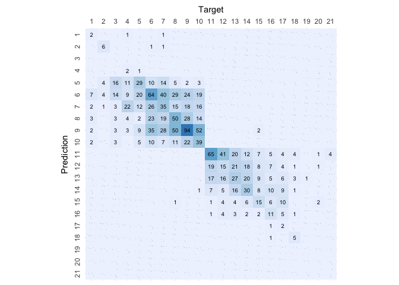

# Support Vector Machine

``` r
# Load libraries
library(e1071)
library(caret)
```

    ## Loading required package: ggplot2

    ## Loading required package: lattice

``` r
library(knitr)

# Load helpers
source("./../helpers/helper.R")
```

## Import Data

``` r
# Read training and testing data
train <- read.csv("./../data/classification_data/intermediates/train.csv")
test <- read.csv("./../data/classification_data/intermediates/test.csv")

# Drop index columns
drops <- c("X.1", "X")
train <- train[, !(names(train) %in% drops)]
test <- test[, !(names(test) %in% drops)]
```

## Model Training

``` r
# Train the model
svm.model <- svm(as.factor(Rating)~., data=train, type='C-classification')
summary(svm.model)
```

    ## 
    ## Call:
    ## svm(formula = as.factor(Rating) ~ ., data = train, type = "C-classification")
    ## 
    ## 
    ## Parameters:
    ##    SVM-Type:  C-classification 
    ##  SVM-Kernel:  radial 
    ##        cost:  1 
    ## 
    ## Number of Support Vectors:  6098
    ## 
    ##  ( 560 70 551 193 637 666 712 367 254 410 329 330 238 394 143 109 50 7 9 14 55 )
    ## 
    ## 
    ## Number of Classes:  21 
    ## 
    ## Levels: 
    ##  1 2 3 4 5 6 7 8 9 10 11 12 13 14 15 16 17 18 19 20 21

## Model Validation

``` r
# Predict the samples from test data using the model
result = predict(svm.model, test, type="raw")

# Print the Confusion matrix
confusion.matrix <- confusionMatrix(as.factor(result), as.factor(test$Rating))
plot.custom.confusion.matrix(confusion.matrix$table)
```

<!-- -->

``` r
# Print the accuracy stats of the model
kable(data.frame(confusion.matrix$overall))
```

|                | confusion.matrix.overall |
|:---------------|-------------------------:|
| Accuracy       |                0.3109244 |
| Kappa          |                0.2463804 |
| AccuracyLower  |                0.2879126 |
| AccuracyUpper  |                0.3346560 |
| AccuracyNull   |                0.1215255 |
| AccuracyPValue |                0.0000000 |
| McnemarPValue  |                      NaN |

``` r
# Print validation stats of the model
kable(data.frame(confusion.matrix$byClass))
```

|           | Sensitivity | Specificity | Pos.Pred.Value | Neg.Pred.Value | Precision |    Recall |        F1 | Prevalence | Detection.Rate | Detection.Prevalence | Balanced.Accuracy |
|:----------|------------:|------------:|---------------:|---------------:|----------:|----------:|----------:|-----------:|---------------:|---------------------:|------------------:|
| Class: 1  |   0.0555556 |   0.9980379 |      0.2500000 |      0.9889825 | 0.2500000 | 0.0555556 | 0.0909091 |  0.0116354 |      0.0006464 |            0.0025856 |         0.5267967 |
| Class: 2  |   0.4000000 |   0.9980418 |      0.6666667 |      0.9941482 | 0.6666667 | 0.4000000 | 0.5000000 |  0.0096962 |      0.0038785 |            0.0058177 |         0.6990209 |
| Class: 3  |   0.0000000 |   1.0000000 |            NaN |      0.9728507 |        NA | 0.0000000 |        NA |  0.0271493 |      0.0000000 |            0.0000000 |         0.5000000 |
| Class: 4  |   0.0576923 |   0.9993311 |      0.7500000 |      0.9682437 | 0.7500000 | 0.0576923 | 0.1071429 |  0.0336134 |      0.0019392 |            0.0025856 |         0.5285117 |
| Class: 5  |   0.3076923 |   0.9516678 |      0.2526316 |      0.9628099 | 0.2526316 | 0.3076923 | 0.2774566 |  0.0504202 |      0.0155139 |            0.0614092 |         0.6296801 |
| Class: 6  |   0.3668639 |   0.8838897 |      0.2792793 |      0.9192453 | 0.2792793 | 0.3668639 | 0.3171355 |  0.1092437 |      0.0400776 |            0.1435036 |         0.6253768 |
| Class: 7  |   0.2551724 |   0.9194009 |      0.2466667 |      0.9226915 | 0.2466667 | 0.2551724 | 0.2508475 |  0.0937298 |      0.0239173 |            0.0969619 |         0.5872866 |
| Class: 8  |   0.3354037 |   0.9249639 |      0.3417722 |      0.9229662 | 0.3417722 | 0.3354037 | 0.3385580 |  0.1040724 |      0.0349063 |            0.1021332 |         0.6301838 |
| Class: 9  |   0.4574468 |   0.8646063 |      0.3185185 |      0.9201253 | 0.3185185 | 0.4574468 | 0.3755459 |  0.1215255 |      0.0555915 |            0.1745314 |         0.6610266 |
| Class: 10 |   0.2847222 |   0.9586600 |      0.4141414 |      0.9288674 | 0.4141414 | 0.2847222 | 0.3374486 |  0.0930834 |      0.0265029 |            0.0639948 |         0.6216911 |
| Class: 11 |   0.6000000 |   0.9269311 |      0.3859649 |      0.9680233 | 0.3859649 | 0.6000000 | 0.4697509 |  0.0711054 |      0.0426632 |            0.1105365 |         0.7634656 |
| Class: 12 |   0.1176471 |   0.9500684 |      0.1204819 |      0.9487705 | 0.1204819 | 0.1176471 | 0.1190476 |  0.0549451 |      0.0064641 |            0.0536522 |         0.5338577 |
| Class: 13 |   0.2417582 |   0.9429945 |      0.2095238 |      0.9521498 | 0.2095238 | 0.2417582 | 0.2244898 |  0.0588235 |      0.0142211 |            0.0678733 |         0.5923764 |
| Class: 14 |   0.3863636 |   0.9609321 |      0.3736264 |      0.9629121 | 0.3736264 | 0.3863636 | 0.3798883 |  0.0568843 |      0.0219780 |            0.0588235 |         0.6736479 |
| Class: 15 |   0.3137255 |   0.9786096 |      0.3333333 |      0.9766511 | 0.3333333 | 0.3137255 | 0.3232323 |  0.0329670 |      0.0103426 |            0.0310278 |         0.6461676 |
| Class: 16 |   0.2608696 |   0.9886742 |      0.4137931 |      0.9776021 | 0.4137931 | 0.2608696 | 0.3200000 |  0.0297350 |      0.0077569 |            0.0187460 |         0.6247719 |
| Class: 17 |   0.0500000 |   0.9993364 |      0.6666667 |      0.9753886 | 0.6666667 | 0.0500000 | 0.0930233 |  0.0258565 |      0.0012928 |            0.0019392 |         0.5246682 |
| Class: 18 |   0.3333333 |   0.9993473 |      0.8333333 |      0.9935107 | 0.8333333 | 0.3333333 | 0.4761905 |  0.0096962 |      0.0032321 |            0.0038785 |         0.6663403 |
| Class: 19 |   0.0000000 |   1.0000000 |            NaN |      0.9993536 |        NA | 0.0000000 |        NA |  0.0006464 |      0.0000000 |            0.0000000 |         0.5000000 |
| Class: 20 |   0.0000000 |   1.0000000 |            NaN |      0.9974144 |        NA | 0.0000000 |        NA |  0.0025856 |      0.0000000 |            0.0000000 |         0.5000000 |
| Class: 21 |   0.0000000 |   1.0000000 |            NaN |      0.9974144 |        NA | 0.0000000 |        NA |  0.0025856 |      0.0000000 |            0.0000000 |         0.5000000 |

``` r
# Save the results
algorithm <- "Support.Vector.Machine"
save.class.acc.result(confusion.matrix$overall, algorithm)
save.class.pvv.result(confusion.matrix$byClass, algorithm)
```

## Prediction with Unknown Data

``` r
# Load the data
unk <- read.csv("./../data/classification_data/intermediates/unknown_data.csv")
```

    ## Warning in read.table(file = file, header = header, sep = sep, quote =
    ## quote, : incomplete final line found by readTableHeader on './../data/
    ## classification_data/intermediates/unknown_data.csv'

``` r
dim(unk)
```

    ## [1]  1 29

``` r
# Predict using the built model
prediction <- predict(svm.model, unk)
prediction
```

    ## 1 
    ## 8 
    ## Levels: 1 2 3 4 5 6 7 8 9 10 11 12 13 14 15 16 17 18 19 20 21
