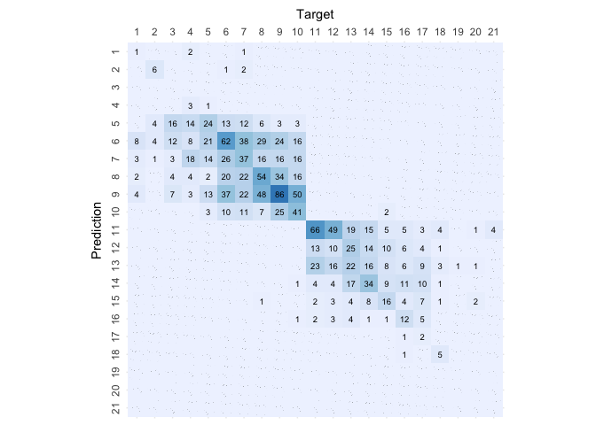

# Support Vector Machine

``` r
# Load libraries
library(e1071)
library(caret)
```

    ## Loading required package: ggplot2

    ## Loading required package: lattice

``` r
library(knitr)

# Load helpers
source("./../helpers/helper.R")
```

## Import Data

``` r
# Read training and testing data
train <- read.csv("./../data/classification_data/intermediates/train.csv")
test <- read.csv("./../data/classification_data/intermediates/test.csv")
```

## Model Training

``` r
# Train the model
svm.model <- svm(as.factor(Rating)~., data=train, type='C-classification')
summary(svm.model)
```

    ## 
    ## Call:
    ## svm(formula = as.factor(Rating) ~ ., data = train, type = "C-classification")
    ## 
    ## 
    ## Parameters:
    ##    SVM-Type:  C-classification 
    ##  SVM-Kernel:  radial 
    ##        cost:  1 
    ## 
    ## Number of Support Vectors:  6106
    ## 
    ##  ( 560 70 546 193 632 670 711 366 258 412 330 332 239 399 143 110 50 7 9 14 55 )
    ## 
    ## 
    ## Number of Classes:  21 
    ## 
    ## Levels: 
    ##  1 2 3 4 5 6 7 8 9 10 11 12 13 14 15 16 17 18 19 20 21

## Model Validation

``` r
# Predict the samples from test data using the model
result = predict(svm.model, test, type="raw")

# Print the Confusion matrix
confusion.matrix <- confusionMatrix(as.factor(result), as.factor(test$Rating))
plot.custom.confusion.matrix(confusion.matrix$table)
```

<!-- -->

``` r
# Print the accuracy stats of the model
kable(data.frame(confusion.matrix$overall))
```

|                | confusion.matrix.overall |
|:---------------|-------------------------:|
| Accuracy       |                0.3173885 |
| Kappa          |                0.2532992 |
| AccuracyLower  |                0.2942356 |
| AccuracyUpper  |                0.3412366 |
| AccuracyNull   |                0.1215255 |
| AccuracyPValue |                0.0000000 |
| McnemarPValue  |                      NaN |

``` r
# Print validation stats of the model
kable(data.frame(confusion.matrix$byClass))
```

|           | Sensitivity | Specificity | Pos.Pred.Value | Neg.Pred.Value | Precision |    Recall |        F1 | Prevalence | Detection.Rate | Detection.Prevalence | Balanced.Accuracy |
|:----------|------------:|------------:|---------------:|---------------:|----------:|----------:|----------:|-----------:|---------------:|---------------------:|------------------:|
| Class: 1  |   0.1111111 |   0.9986920 |      0.5000000 |      0.9896306 | 0.5000000 | 0.1111111 | 0.1818182 |  0.0116354 |      0.0012928 |            0.0025856 |         0.5549015 |
| Class: 2  |   0.4000000 |   0.9986945 |      0.7500000 |      0.9941520 | 0.7500000 | 0.4000000 | 0.5217391 |  0.0096962 |      0.0038785 |            0.0051713 |         0.6993473 |
| Class: 3  |   0.0000000 |   1.0000000 |            NaN |      0.9728507 |        NA | 0.0000000 |        NA |  0.0271493 |      0.0000000 |            0.0000000 |         0.5000000 |
| Class: 4  |   0.0384615 |   0.9993311 |      0.6666667 |      0.9676166 | 0.6666667 | 0.0384615 | 0.0727273 |  0.0336134 |      0.0012928 |            0.0019392 |         0.5188963 |
| Class: 5  |   0.3717949 |   0.9557522 |      0.3085106 |      0.9662767 | 0.3085106 | 0.3717949 | 0.3372093 |  0.0504202 |      0.0187460 |            0.0607628 |         0.6637735 |
| Class: 6  |   0.3786982 |   0.8795356 |      0.2782609 |      0.9202733 | 0.2782609 | 0.3786982 | 0.3208020 |  0.1092437 |      0.0413704 |            0.1486749 |         0.6291169 |
| Class: 7  |   0.2413793 |   0.9179743 |      0.2333333 |      0.9212598 | 0.2333333 | 0.2413793 | 0.2372881 |  0.0937298 |      0.0226244 |            0.0969619 |         0.5796768 |
| Class: 8  |   0.3105590 |   0.9307359 |      0.3424658 |      0.9207709 | 0.3424658 | 0.3105590 | 0.3257329 |  0.1040724 |      0.0323206 |            0.0943762 |         0.6206475 |
| Class: 9  |   0.5000000 |   0.8646063 |      0.3381295 |      0.9259259 | 0.3381295 | 0.5000000 | 0.4034335 |  0.1215255 |      0.0607628 |            0.1797027 |         0.6823032 |
| Class: 10 |   0.2708333 |   0.9572345 |      0.3939394 |      0.9274862 | 0.3939394 | 0.2708333 | 0.3209877 |  0.0930834 |      0.0252101 |            0.0639948 |         0.6140339 |
| Class: 11 |   0.5909091 |   0.9318024 |      0.3987730 |      0.9674855 | 0.3987730 | 0.5909091 | 0.4761905 |  0.0711054 |      0.0420168 |            0.1053652 |         0.7613557 |
| Class: 12 |   0.1764706 |   0.9459644 |      0.1595745 |      0.9518238 | 0.1595745 | 0.1764706 | 0.1675978 |  0.0549451 |      0.0096962 |            0.0607628 |         0.5612175 |
| Class: 13 |   0.2967033 |   0.9471154 |      0.2596154 |      0.9556480 | 0.2596154 | 0.2967033 | 0.2769231 |  0.0588235 |      0.0174531 |            0.0672269 |         0.6219093 |
| Class: 14 |   0.3409091 |   0.9609321 |      0.3448276 |      0.9602740 | 0.3448276 | 0.3409091 | 0.3428571 |  0.0568843 |      0.0193924 |            0.0562379 |         0.6509206 |
| Class: 15 |   0.2941176 |   0.9772727 |      0.3061224 |      0.9759680 | 0.3061224 | 0.2941176 | 0.3000000 |  0.0329670 |      0.0096962 |            0.0316742 |         0.6356952 |
| Class: 16 |   0.2391304 |   0.9880080 |      0.3793103 |      0.9769433 | 0.3793103 | 0.2391304 | 0.2933333 |  0.0297350 |      0.0071105 |            0.0187460 |         0.6135692 |
| Class: 17 |   0.0500000 |   0.9993364 |      0.6666667 |      0.9753886 | 0.6666667 | 0.0500000 | 0.0930233 |  0.0258565 |      0.0012928 |            0.0019392 |         0.5246682 |
| Class: 18 |   0.3333333 |   0.9993473 |      0.8333333 |      0.9935107 | 0.8333333 | 0.3333333 | 0.4761905 |  0.0096962 |      0.0032321 |            0.0038785 |         0.6663403 |
| Class: 19 |   0.0000000 |   1.0000000 |            NaN |      0.9993536 |        NA | 0.0000000 |        NA |  0.0006464 |      0.0000000 |            0.0000000 |         0.5000000 |
| Class: 20 |   0.0000000 |   1.0000000 |            NaN |      0.9974144 |        NA | 0.0000000 |        NA |  0.0025856 |      0.0000000 |            0.0000000 |         0.5000000 |
| Class: 21 |   0.0000000 |   1.0000000 |            NaN |      0.9974144 |        NA | 0.0000000 |        NA |  0.0025856 |      0.0000000 |            0.0000000 |         0.5000000 |

``` r
# Save the results
algorithm <- "Support.Vector.Machine"
save.class.acc.result(confusion.matrix$overall, algorithm)
save.class.pvv.result(confusion.matrix$byClass, algorithm)
```
