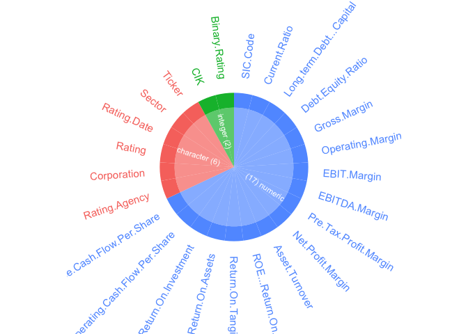
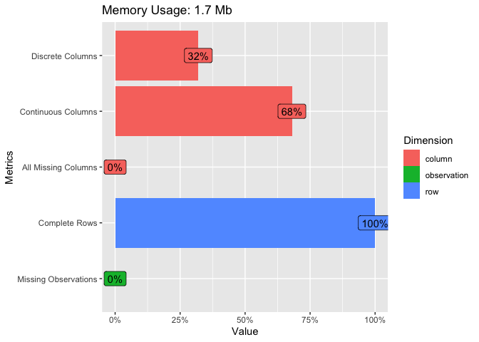
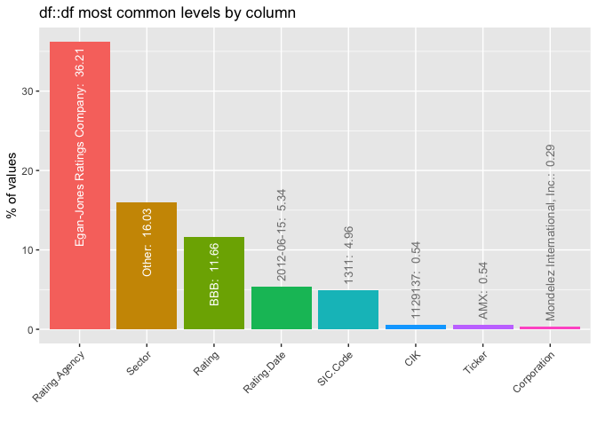
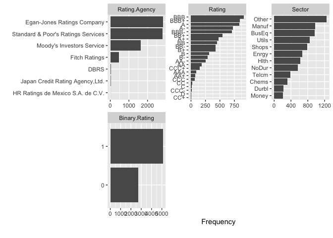
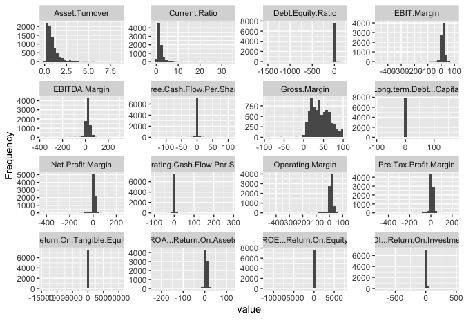
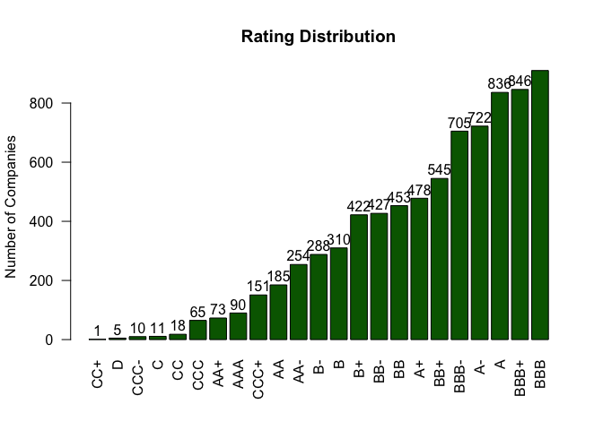
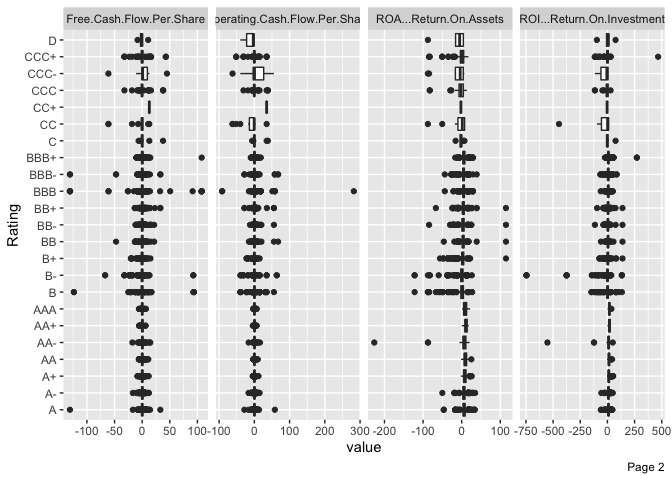

# Exploratory Data Analysis

Exploratory Data Analysis enables us to understand the dataset clearly.
It also helps in cleaning the data which will further help us to
maximize the output from the machine learning models.

``` r
library(DataExplorer)
library(dplyr)
```

    ## 
    ## Attaching package: 'dplyr'

    ## The following objects are masked from 'package:stats':
    ## 
    ##     filter, lag

    ## The following objects are masked from 'package:base':
    ## 
    ##     intersect, setdiff, setequal, union

``` r
library(inspectdf)
```

``` r
df <- read.csv("./../data/classification_data/input/corporate_credit_rating.csv")
```

``` r
head(df)
```

    ##                        Rating.Agency                    Corporation Rating
    ## 1 Standard & Poor's Ratings Services      American States Water Co.     A-
    ## 2 Standard & Poor's Ratings Services Automatic Data Processing Inc.    AAA
    ## 3 Standard & Poor's Ratings Services                     Avnet Inc.   BBB-
    ## 4 Standard & Poor's Ratings Services   California Water Service Co.    AA-
    ## 5 Standard & Poor's Ratings Services           Cardinal Health Inc.      A
    ## 6 Standard & Poor's Ratings Services           Cardinal Health Inc.   BBB+
    ##   Rating.Date     CIK Binary.Rating SIC.Code Sector Ticker Current.Ratio
    ## 1  2010-07-30 1056903             1     4941  Utils    AWR        1.1507
    ## 2  2010-09-16    8670             1     7374  BusEq    ADP        1.1129
    ## 3  2010-11-23    8858             1     5065  Shops    AVT        1.9276
    ## 4  2010-06-29 1035201             1     4941  Utils    CWT        0.8358
    ## 5  2010-07-14  721371             1     5122  Shops    CAH        1.2931
    ## 6  2010-09-16  721371             1     5122  Shops    CAH        1.2931
    ##   Long.term.Debt...Capital Debt.Equity.Ratio Gross.Margin Operating.Margin
    ## 1                   0.4551            0.8847      77.6230          19.4839
    ## 2                   0.0072            0.0073      43.6619          19.8327
    ## 3                   0.2924            0.4255      11.9008           3.3173
    ## 4                   0.4708            0.9491      64.5096          18.4549
    ## 5                   0.2644            0.4036       3.8385           1.3269
    ## 6                   0.2644            0.4036       3.8385           1.3269
    ##   EBIT.Margin EBITDA.Margin Pre.Tax.Profit.Margin Net.Profit.Margin
    ## 1     19.4839       28.9834               13.6093            8.3224
    ## 2     19.8327       23.9379               20.8699           13.5690
    ## 3      3.3173        3.6338                3.0536            2.1418
    ## 4     18.4549       27.9377               15.1135            9.0246
    ## 5      1.3269        1.5847                1.2304            0.6518
    ## 6      1.3269        1.5847                1.2304            0.6518
    ##   Asset.Turnover ROE...Return.On.Equity Return.On.Tangible.Equity
    ## 1         0.3173                 8.1724                    8.1978
    ## 2         0.3324                22.0354                   47.2858
    ## 3         2.4620                13.6376                   16.7991
    ## 4         0.2946                 9.6412                    9.7015
    ## 5         4.9276                11.1256                   19.4184
    ## 6         4.9276                11.1256                   19.4184
    ##   ROA...Return.On.Assets ROI...Return.On.Investment
    ## 1                 2.6385                     4.4530
    ## 2                 4.4944                    21.8765
    ## 3                 5.2731                     9.6494
    ## 4                 2.6583                     5.1018
    ## 5                 2.9364                     8.1844
    ## 6                 2.9364                     8.1844
    ##   Operating.Cash.Flow.Per.Share Free.Cash.Flow.Per.Share
    ## 1                        1.9957                  -0.1333
    ## 2                        0.2501                   0.3132
    ## 3                       -7.6079                  -7.3231
    ## 4                        1.7438                  -0.8999
    ## 5                        1.9725                   2.4174
    ## 6                        1.9725                   2.4174

## Features Analysis

``` r
colnames(df)
```

    ##  [1] "Rating.Agency"                 "Corporation"                  
    ##  [3] "Rating"                        "Rating.Date"                  
    ##  [5] "CIK"                           "Binary.Rating"                
    ##  [7] "SIC.Code"                      "Sector"                       
    ##  [9] "Ticker"                        "Current.Ratio"                
    ## [11] "Long.term.Debt...Capital"      "Debt.Equity.Ratio"            
    ## [13] "Gross.Margin"                  "Operating.Margin"             
    ## [15] "EBIT.Margin"                   "EBITDA.Margin"                
    ## [17] "Pre.Tax.Profit.Margin"         "Net.Profit.Margin"            
    ## [19] "Asset.Turnover"                "ROE...Return.On.Equity"       
    ## [21] "Return.On.Tangible.Equity"     "ROA...Return.On.Assets"       
    ## [23] "ROI...Return.On.Investment"    "Operating.Cash.Flow.Per.Share"
    ## [25] "Free.Cash.Flow.Per.Share"

``` r
column_types <- inspect_types(df)
column_types
```

    ## # A tibble: 3 × 4
    ##   type        cnt  pcnt col_name    
    ##   <chr>     <int> <dbl> <named list>
    ## 1 numeric      17    68 <chr [17]>  
    ## 2 character     6    24 <chr [6]>   
    ## 3 integer       2     8 <chr [2]>

``` r
column_types %>% show_plot()
```

<!-- -->

Columns such as *CIK*, and *SIC Code* have wrong data types associated
with them.

| Column Name | Present Date Type | Target Data Type |
|-------------|-------------------|------------------|
| CIK         | integer           | character        |
| SIC Code    | double            | character        |

Wrong data types associated columns

``` r
# Convert wrongly associated data types to correct ones.
df$CIK <- as.factor(df$CIK)
df$SIC.Code <- as.factor(df$SIC.Code)
```

Let us visualize the structure of the dataset.

``` r
plot_str(df)
```

``` r
introduce(df)
```

    ##   rows columns discrete_columns continuous_columns all_missing_columns
    ## 1 7805      25                8                 17                   0
    ##   total_missing_values complete_rows total_observations memory_usage
    ## 1                    0          7805             195125      1772048

``` r
plot_intro(df)
```

<!-- -->

There are no missing values in the dataset which is a boon in disguise.
Also the number of categorical numbers to deal with and convert to
machine readable, interpretable numbers are quite less as compared to
the number of numerical columns. Moreover, not every categorical column
is relevant for creating a model.

``` r
inspect_imb(df)
```

    ## # A tibble: 8 × 4
    ##   col_name      value                          pcnt   cnt
    ##   <chr>         <chr>                         <dbl> <int>
    ## 1 Rating.Agency Egan-Jones Ratings Company   36.2    2826
    ## 2 Sector        Other                        16.0    1251
    ## 3 Rating        BBB                          11.7     910
    ## 4 Rating.Date   2012-06-15                    5.34    417
    ## 5 SIC.Code      1311                          4.96    387
    ## 6 CIK           1129137                       0.538    42
    ## 7 Ticker        AMX                           0.538    42
    ## 8 Corporation   Mondelez International, Inc.  0.295    23

``` r
inspect_imb(df) %>% show_plot()
```

    ## Warning: `guides(<scale> = FALSE)` is deprecated. Please use `guides(<scale> =
    ## "none")` instead.

<!-- -->

The above graph shows the imbalance in the most dominant class in the
categorical variables. Following are some observations that can be made:

1.  The *Rating Agency* is dominated by “Egan-Jones Ratings Company”,
    but it will more useful to know credit rating agency which does not
    have enough representation.

2.  *CIK*, *Ticker*, and *Corporation* should have very high variance of
    categories and hence will be useful to remove them before modelling.

3.  The dataset is led by companies with “BBB” rating, though 11.66%
    representation by the dominant may not be consider as a serious
    imbalance which will require treatment. But it will be noteworthy to
    find the rating that is under-represented which can be treated as
    outliers, or will need specialized treatment such as oversampling.

These variables will be analyzed separately in the univariate analysis
section.

## Univariate Analysis

### Categorical Variables

``` r
plot_bar(df)
```

    ## 5 columns ignored with more than 50 categories.
    ## Corporation: 1377 categories
    ## Rating.Date: 1414 categories
    ## CIK: 686 categories
    ## SIC.Code: 240 categories
    ## Ticker: 678 categories

<!-- -->

``` r
data.frame(table(df$Rating.Agency))
```

    ##                                 Var1 Freq
    ## 1                               DBRS   26
    ## 2         Egan-Jones Ratings Company 2826
    ## 3                      Fitch Ratings  477
    ## 4  HR Ratings de Mexico S.A. de C.V.    5
    ## 5    Japan Credit Rating Agency,Ltd.   22
    ## 6          Moody's Investors Service 1636
    ## 7 Standard & Poor's Ratings Services 2813

The number of companies rated by last three credit rating agencies are
too few to be useful for analysis. It will be beneficial to remove them
from the dataset. Thus, data for following credit rating agencies will
be removed:

1.  DBRS
2.  Japan Credit Rating Agency, Ltd.
3.  HR Ratings de Mexico S.A. de C.V.

``` r
# Find data associated with ratings having less 10 observations
ratings.count.df <- data.frame(table(df$Rating))
colnames(ratings.count.df)
```

    ## [1] "Var1" "Freq"

``` r
rtl.data <- ratings.count.df[ratings.count.df$Freq<10,]
rtl.data
```

    ##    Var1 Freq
    ## 19  CC+    1
    ## 23    D    5

Data associated with these ratings will also be removed since, they are
insufficient for model to generate any insight.

There are no categorical columns which have low variance and hence no
data treatment is required for that consideration.

``` r
plot_histogram(df)
```

<!-- -->

Almost every numerical columns seems to have data points which can be
considered as outliers. But it is not appropriate to alter those data
points as they are crucial for modelling the data. More appropriate plot
to identify the columns with extreme values is box plot (to be analyzed
in the next section).

## Multivariate Analysis

``` r
plot_boxplot(df, by='Rating')
```

<!-- --><!-- -->

Some prominent outliers are present in the following columns:

1.  Asset Turnover Ratio
2.  Long-term Debt Capital
3.  Return on Tangible Equity
4.  Return on Assets
5.  Return on Equity
6.  Operating Cash Flow Per Share
7.  Return on Investments

Though outliers are present in individual features but they may not be
true outliers and there is a possibility of information by removing
them. To mitigate this issue, it will be more appropriate to consider an
observation as a whole to find the true outliers.

## Correlation Analysis

Correlation analysis can only be perform on numerical columns and hence
appropriate data needs to be subset.

``` r
# Select data with only numerical columns
num.data <- df %>% dplyr::select(where(is.numeric))
```

``` r
plot_correlation(num.data)
```

<!-- -->

It can be observed that *Operating Margin*, *EBIT Margin*, *EBITDA
Margin*, *Pre Tax Profit Margin*, *Return on Assets* and *Net Profit
Margin* are highly correlated with each other. Hence it will be better
to remove correlated columns. Consider the threshold to be 0.7.
