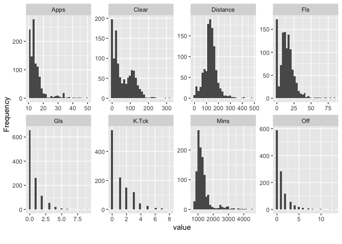

# Exploratory Data Analysis

Exploratory Data Analysis enables us to understand the dataset clearly.
It also helps in cleaning the data which will further help us to
maximize the output from the machine learning models.

``` r
library(caret)
```

    ## Loading required package: ggplot2

    ## Loading required package: lattice

``` r
library(DataExplorer)
library(dplyr)
```

    ## 
    ## Attaching package: 'dplyr'

    ## The following objects are masked from 'package:stats':
    ## 
    ##     filter, lag

    ## The following objects are masked from 'package:base':
    ## 
    ##     intersect, setdiff, setequal, union

``` r
library(inspectdf)
```

``` r
df <- read.csv("./../data/regression_data/input/player_data.csv")
```

``` r
head(df)
```

    ##   X            Name Apps Mins  Mins.Gm Height Weight Age Av.Rat Gls Gls.90
    ## 1 0 Josip Mijatović   12  809 67.41667    173     68  20   7.14   1   0.11
    ## 2 1   Duje Ninčević   15 1161 77.40000    172     69  25   6.84   0   0.00
    ## 3 2 Marin Karabatić   15 1350 90.00000    170     62  22   6.90   0   0.00
    ## 4 3    Vicko Ševelj   20 1738 86.90000    192     86  22   7.15   1   0.05
    ## 5 4   Fran Vujnović   15 1384 92.26667    190     77  19   7.23   4   0.26
    ## 6 5  Šimun Mikolčić   15 1380 92.00000    180     70  18   7.32   1   0.07
    ##   Shot.. Pen.R   xG Ch.C.90 Asts.90 K.Ps.90 Pas.. Cr.C.A Drb.90 Distance Hdr..
    ## 1   0.67     0 0.18    0.00    0.22    1.78  0.92   0.30   0.11    102.6  0.73
    ## 2   0.38     0 0.56    0.08    0.39    1.09  0.90   0.75   0.16    150.3  0.71
    ## 3   0.10     0 3.31    0.14    0.00    0.73  0.89   0.28   0.33    172.8  0.79
    ## 4   0.30     0 0.42    0.00    0.26    0.31  0.87   0.15   0.05    101.9  0.80
    ## 5   0.33     0 0.00    0.00    0.13    0.00  0.80   0.00   0.00     22.2  0.63
    ## 6   0.33     0 0.04    0.00    0.20    0.07  0.78   0.00   0.07     18.8  0.50
    ##   K.Tck Fls Int.90 Clear Con.90 xSv.. Sv.. Svh Svt Svp Pens.Saved.Ratio PoM
    ## 1     0  13   1.45    24      0     0    0   0   0   0                0   1
    ## 2     0  19   1.47    46      0     0    0   0   0   0                0   0
    ## 3     7  21   2.93    78      0     0    0   0   0   0                0   1
    ## 4     2  17   1.40    74      0     0    0   0   0   0                0   1
    ## 5     0  14   0.39    16      0     0    0   0   0   0                0   0
    ## 6     0  20   0.20     0      0     0    0   0   0   0                0   0
    ##   Aer.A.90 Off                          Based Tck.R CA Saves Saves.xSv.
    ## 1     4.45   0         Croatia (3. HNL Zapad)  0.88 84     0          0
    ## 2     4.26   0           Croatia (3. HNL Jug)  0.76 79     0          0
    ## 3     6.73   0           Croatia (3. HNL Jug)  0.77 87     0          0
    ## 4     5.75   1 Bosnia & Herzegovina (Liga 12)  0.88 95     0          0
    ## 5     1.56   0         Croatia (3. HNL Istok)  0.93 83     0          0
    ## 6     0.26   0         Croatia (3. HNL Istok)  0.75 81     0          0
    ##      Gls.xG  Dist.Mins Transfer.Value  Value
    ## 1  5.555556 0.12682324      €3K - €9K   6000
    ## 2  0.000000 0.12945736     €0 - €2.5K   1250
    ## 3  0.000000 0.12800000      €0 - €12K   6000
    ## 4  2.380952 0.05863061    €100K - €1M 550000
    ## 5  0.000000 0.01604046   €14K - €150K  82000
    ## 6 25.000000 0.01362319   €35K - €350K 192500

``` r
dim(df)
```

    ## [1] 1122   45

## Features Analysis

``` r
names(df)
```

    ##  [1] "X"                "Name"             "Apps"             "Mins"            
    ##  [5] "Mins.Gm"          "Height"           "Weight"           "Age"             
    ##  [9] "Av.Rat"           "Gls"              "Gls.90"           "Shot.."          
    ## [13] "Pen.R"            "xG"               "Ch.C.90"          "Asts.90"         
    ## [17] "K.Ps.90"          "Pas.."            "Cr.C.A"           "Drb.90"          
    ## [21] "Distance"         "Hdr.."            "K.Tck"            "Fls"             
    ## [25] "Int.90"           "Clear"            "Con.90"           "xSv.."           
    ## [29] "Sv.."             "Svh"              "Svt"              "Svp"             
    ## [33] "Pens.Saved.Ratio" "PoM"              "Aer.A.90"         "Off"             
    ## [37] "Based"            "Tck.R"            "CA"               "Saves"           
    ## [41] "Saves.xSv."       "Gls.xG"           "Dist.Mins"        "Transfer.Value"  
    ## [45] "Value"

``` r
column_types <- inspect_types(df)
column_types
```

    ## # A tibble: 3 × 4
    ##   type        cnt  pcnt col_name    
    ##   <chr>     <int> <dbl> <named list>
    ## 1 numeric      39 86.7  <chr [39]>  
    ## 2 character     3  6.67 <chr [3]>   
    ## 3 integer       3  6.67 <chr [3]>

11, 15, 16, 17, 20, 25, 27, 35

``` r
column_types %>% show_plot()
```

<!-- -->

The column *X* is just an index number and hence it can be removed since
it will provide to information to the models. Moreover, the column
*Transfer Value* contains a range which can be splitted into 2 columns
which will contain the lower value and the upper value of the transfer
of the player.

Let us visualize the structure of the dataset.

``` r
plot_str(df)
```

``` r
introduce(df)
```

    ##   rows columns discrete_columns continuous_columns all_missing_columns
    ## 1 1122      45                3                 42                   0
    ##   total_missing_values complete_rows total_observations memory_usage
    ## 1                    0          1122              50490       522160

``` r
plot_intro(df)
```

<!-- -->

There are no missing values in the dataset. The dataset is mostly
composed of numbers rather than categories and hence the amount of
preprocessing that will be required to make it fit for modelling will be
less.

``` r
inspect_imb(df)
```

    ## # A tibble: 3 × 4
    ##   col_name       value             pcnt   cnt
    ##   <chr>          <chr>            <dbl> <int>
    ## 1 Based          France (Ligue 1) 7.58     85
    ## 2 Transfer.Value €160K - €1.6M    1.60     18
    ## 3 Name           Ederson          0.357     4

``` r
inspect_imb(df) %>% show_plot()
```

    ## Warning: `guides(<scale> = FALSE)` is deprecated. Please use `guides(<scale> =
    ## "none")` instead.

<!-- -->

The percentage of dominant class is low in all the 3 categorical columns
and hence no preprocessing related to sampling will be required for
modelling the data.

``` r
length(unique(df$Name))
```

    ## [1] 1103

``` r
length(unique(df$Based))
```

    ## [1] 82

## Univariate Analysis

### Categorical Variables

``` r
data.frame(table(df$Based))
```

    ##                                                Var1 Freq
    ## 1                      Argentina (Liga Profesional)   16
    ## 2                         Austria (ADMIRAL 2. Liga)    9
    ## 3                      Austria (Admiral Bundesliga)   24
    ## 4                           Belgium (1B Pro League)   10
    ## 5                        Belgium (Eerste nationale)    2
    ## 6                              Belgium (Pro League)   39
    ## 7                    Bosnia & Herzegovina (Liga 12)    7
    ## 8                       Brazil (Brasileiro Série A)   20
    ## 9            Brazil (Campeonato Brasileiro Série B)    3
    ## 10                         Chile (Primera División)    3
    ## 11                         China (CFA Super League)    3
    ## 12                   Colombia (Categoría Primera A)   11
    ## 13                           Croatia (3. HNL Istok)   13
    ## 14                             Croatia (3. HNL Jug)   24
    ## 15                           Croatia (3. HNL Zapad)   13
    ## 16                              Croatia (Druga HNL)   25
    ## 17                               Croatia (Prva HNL)   36
    ## 18              Croatia (Regionalne Lige - Sibenik)    1
    ## 19                           Cyprus (A' Katigorías)   11
    ## 20                              Denmark (Superliga)    6
    ## 21                       DR Congo (Vodacom Ligue 1)    1
    ## 22                                Ecuador (Serie A)    1
    ## 23                       England (EFL Championship)    7
    ## 24                         England (EFL League One)    1
    ## 25                         England (Premier League)   53
    ## 26                                 France (Ligue 1)   85
    ## 27                                 France (Ligue 2)   81
    ## 28                     France (National 2 Groupe A)    3
    ## 29                     France (National 2 Groupe B)    4
    ## 30                     France (National 2 Groupe C)   11
    ## 31                     France (National 2 Groupe D)    4
    ## 32         France (National 3 Auvergne-Rhône-Alpes)    1
    ## 33              France (National 3 Hauts-de-France)    1
    ## 34                France (National 3 Île-de-France)    2
    ## 35           France (National 3 Méditerranée-Corse)    2
    ## 36           France (National 3 Nouvelle-Aquitaine)    1
    ## 37             France (National 3 Pays de la Loire)    2
    ## 38                          Germany (2. Bundesliga)    1
    ## 39                             Germany (Bundesliga)    6
    ## 40                         Holland (Eerste Divisie)    5
    ## 41                             Holland (Eredivisie)   42
    ## 42                          Hungary (OTP Bank Liga)    1
    ## 43                             Israel (Ligat Ha'Al)    1
    ## 44              Italy (Lega Nazionale Dilettanti A)    4
    ## 45              Italy (Lega Nazionale Dilettanti C)    4
    ## 46              Italy (Lega Nazionale Dilettanti D)    3
    ## 47              Italy (Lega Nazionale Dilettanti E)   12
    ## 48              Italy (Lega Nazionale Dilettanti F)    5
    ## 49              Italy (Lega Nazionale Dilettanti H)    6
    ## 50                                  Italy (Serie A)   68
    ## 51                                  Italy (Serie B)   54
    ## 52                                Italy (Serie C/A)    4
    ## 53                                Italy (Serie C/B)    7
    ## 54                            Mexico (Liga BBVA MX)   14
    ## 55                      Moldova (Divizia Naţională)    1
    ## 56                             Norway (Eliteserien)    3
    ## 57                      Paraguay (Primera División)    3
    ## 58                             Poland (Ekstraklasa)   10
    ## 59      Portugal (Campeonato D`Elite Série 2 Porto)    1
    ## 60 Portugal (Campeonato dos Açores - Ponta Delgada)    7
    ## 61            Portugal (Campeonato Safina - Aveiro)    3
    ## 62                            Portugal (FPF Liga 3)   17
    ## 63                          Portugal (Liga 3 Norte)   21
    ## 64                            Portugal (Liga 3 Sul)   14
    ## 65                       Portugal (Liga Portugal 2)   59
    ## 66     Portugal (Primeira Divisão - Castelo Branco)    1
    ## 67                         Portugal (Primeira Liga)   66
    ## 68                  Portugal (Pro-Nacional - Braga)    1
    ## 69                                 Romania (Liga I)    1
    ## 70                            Russia (Premier Liga)    3
    ## 71                              Serbia (Super liga)    2
    ## 72                                Slovenia (1. SNL)   12
    ## 73                                Slovenia (2. SNL)    4
    ## 74                                 Spain (LaLiga 2)    1
    ## 75                                   Spain (LaLiga)   45
    ## 76                             Sweden (Allsvenskan)    2
    ## 77                   Switzerland (Challenge League)    1
    ## 78                       Switzerland (Super League)   16
    ## 79                               Turkey (Süper Lig)    3
    ## 80                                     U.S.A. (MLS)   43
    ## 81                            Ukraine (Favbet Liha)    5
    ## 82                    Uruguay (Campeonato Uruguayo)    4

The number of locations is quite large and hence it will be not be
possible to understand the distribution by plotting. But it can be noted
that a lot of locations are represented by only 1 or 2 players and hence
the information related to such observations may not be useful for
modelling the data. But since the number of observations present are
less in number it will not be apt to remove those observations. On the
other hand, the *Based* column can itself be removed so that its
information is not used by the model and create any bias in the models.

``` r
# Identify the locations represented by only 1 player
based.count.df <- data.frame(table(df$Based))
bc.data <- based.count.df[based.count.df$Freq==1,]
bc.data
```

    ##                                            Var1 Freq
    ## 18          Croatia (Regionalne Lige - Sibenik)    1
    ## 21                   DR Congo (Vodacom Ligue 1)    1
    ## 22                            Ecuador (Serie A)    1
    ## 24                     England (EFL League One)    1
    ## 32     France (National 3 Auvergne-Rhône-Alpes)    1
    ## 33          France (National 3 Hauts-de-France)    1
    ## 36       France (National 3 Nouvelle-Aquitaine)    1
    ## 38                      Germany (2. Bundesliga)    1
    ## 42                      Hungary (OTP Bank Liga)    1
    ## 43                         Israel (Ligat Ha'Al)    1
    ## 55                  Moldova (Divizia Naţională)    1
    ## 59  Portugal (Campeonato D`Elite Série 2 Porto)    1
    ## 66 Portugal (Primeira Divisão - Castelo Branco)    1
    ## 68              Portugal (Pro-Nacional - Braga)    1
    ## 69                             Romania (Liga I)    1
    ## 74                             Spain (LaLiga 2)    1
    ## 77               Switzerland (Challenge League)    1

There are 17 locations which are represented by 1 player only.

``` r
plot_histogram(df)
```

<!-- --><!-- --><!-- -->

``` r
plot_histogram(df[,c(3, 4, 10, 21, 23, 24, 26, 36)])
```

<!-- -->

``` r
perf.cols <- c(3, 4, 10, 21, 23, 24, 26, 36)
for (i in perf.cols){
  print(paste(names(df)[i], "->", mean(df[,i])))
}
```

    ## [1] "Apps -> 15.1417112299465"
    ## [1] "Mins -> 1316.80659536542"
    ## [1] "Gls -> 0.735294117647059"
    ## [1] "Distance -> 133.691176470588"
    ## [1] "K.Tck -> 1.15418894830659"
    ## [1] "Fls -> 14.3484848484848"
    ## [1] "Clear -> 58.9162210338681"
    ## [1] "Off -> 1.00445632798574"

``` r
?boxplot
boxplot(df[,c(11, 15, 16, 17,  20,  25,  27)], horizontal = TRUE)
```

<!-- -->

There are few variables which have outliers in them but more clear
picture will be given in multivariate by comparing with the target
variable. Also some variables have 1 value as most dominant and hence
columns with low or near zero variance needs to be identified and acted
upon.

``` r
colnames(df[,nearZeroVar(df)])
```

    ##  [1] "Pen.R"            "Con.90"           "xSv.."            "Sv.."            
    ##  [5] "Svh"              "Svt"              "Svp"              "Pens.Saved.Ratio"
    ##  [9] "Saves"            "Saves.xSv."

These columns have variances which are near zero meaning they have
little information that can contribute to the model learning. Hence it
will be better to remove such columns.

## Multivariate Analysis

``` r
plot_boxplot(df, by='CA')
```

<!-- --><!-- --><!-- --><!-- -->

Some prominent outliers are present in the following columns:

1.  Gaols divided by expected goals
2.  Number of saves
3.  Penalty score ratio
4.  Expected goals
5.  Shots caught
6.  Percentage of expected saves
7.  Average transfer value

Though outliers are present in individual features but they may not be
true outliers and there is a possibility of information loss by removing
them. To mitigate this issue, it will be more appropriate to consider an
observation as a whole to find the true outliers.

``` r
pairs(df[,c(18, 25, 26, 27, 30, 31, 32, 39)])
```

<!-- -->

``` r
hist(df$CA, main="Target Variable Distribution", col="darkgreen", xlab="Current Ability Score")
```

<!-- -->

``` r
print(max(df$Age))
```

    ## [1] 39

``` r
print(min(df$Age))
```

    ## [1] 18

``` r
hist(df$Age, main="Age distribution", col="darkblue", xlab="Age of Players")
```

<!-- -->

## Correlation Analysis

Correlation analysis can only be perform on numerical columns and hence
appropriate data needs to be subset.

``` r
# Select data with only numerical columns
num.data <- df %>% dplyr::select(where(is.numeric))
```

``` r
plot_correlation(num.data)
```

<!-- -->

For the above heatmap, it can be observed that there exist some highly
correlated features which are:

1.  Penalty saved ratio, Penalty Score ratio
2.  Saves, Clearances per game, Shots caught, shots repelled, shots
    blocked
3.  Aerial attempts per game, Clearances in total, Interceptions made
    per game

Correlated features should be removes to build better models.
