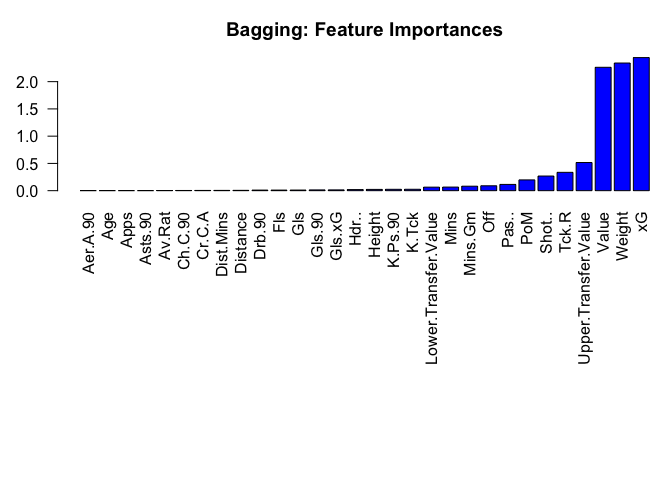

# Bagging

Since the data has been cleaned, it can now be used to create the
models.

``` r
# Load libraries
library(caret)
```

    ## Loading required package: ggplot2

    ## Loading required package: lattice

``` r
library(ipred)
library(MASS)

# Load helpers
source("./../helpers/helper.R")
```

## Import data

To evaluate the model, there should be a set of which the model has not
seen and for which the labels are known. Hence, it is necessary to split
the data into training and testing set.

``` r
# Read training and testing data
train <- read.csv("./../data/regression_data/intermediates/train.csv")
test <- read.csv("./../data/regression_data/intermediates/test.csv")
```

## Model Training

The model is first trained on the training data and then evaluated on
testing data.

``` r
# Model training
bag.model <- bagging(CA~., data=train)
```

``` r
bag.model
```

    ## 
    ## Bagging regression trees with 25 bootstrap replications 
    ## 
    ## Call: bagging.data.frame(formula = CA ~ ., data = train)

``` r
summary(bag.model)
```

    ##        Length Class      Mode   
    ## y      898    -none-     numeric
    ## X       30    data.frame list   
    ## mtrees  25    -none-     list   
    ## OOB      1    -none-     logical
    ## comb     1    -none-     logical
    ## call     3    -none-     call

## Model Validation

``` r
# Predict the samples from test data using the model
result <- predict(bag.model, test)

# Print the RMSE and MAE
cat(paste("RMSE: ", RMSE(result, test$CA), "\n", "MSE: ", RMSE(result, test$CA)^2, "\n", "MAE: ", MAE(result, test$CA)))
```

    ## RMSE:  9.18473342013166 
    ##  MSE:  84.3593279988834 
    ##  MAE:  7.18753041501592

``` r
# Plot feature importance
varImp.df <- data.frame(varImp(bag.model))
varImp.df$Overall <- varImp.df[order(varImp.df$Overall, decreasing = FALSE),]
par(mar=c(15,3,3,0))
barplot(varImp.df$Overall, names.arg=rownames(varImp.df), las=2, col="blue", main="Bagging: Feature Importances")
```

<!-- -->

``` r
# Save the results
save.reg.result(RMSE(result, test$CA), MAE(result, test$CA), "Regression with Bagging")
```

## Prediction with Unknown Data

``` r
# Load the data
unk <- read.csv("./../data/regression_data/intermediates/unknown_data.csv")
```

    ## Warning in read.table(file = file, header = header, sep = sep, quote = quote, :
    ## incomplete final line found by readTableHeader on './../data/regression_data/
    ## intermediates/unknown_data.csv'

``` r
dim(unk)
```

    ## [1]  1 30

``` r
# Predict using the built model
prediction <- predict(bag.model, unk)
prediction
```

    ## [1] 100.1481
