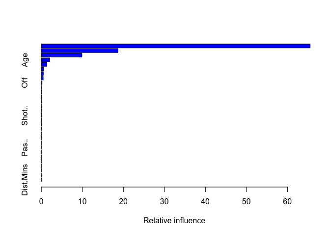

# Gradient Descent

Since the data has been cleaned, it can now be used to create the
models.

``` r
# Load libraries
library(caret)
```

    ## Loading required package: ggplot2

    ## Loading required package: lattice

``` r
library(gbm)
```

    ## Loaded gbm 2.1.8

``` r
library(MASS)

# Load helpers
source("./../helpers/helper.R")
```

## Import data

To evaluate the model, there should be a set of which the model has not
seen and for which the labels are known. Hence, it is necessary to split
the data into training and testing set.

``` r
# Read training and testing data
train <- read.csv("./../data/regression_data/intermediates/train.csv")
test <- read.csv("./../data/regression_data/intermediates/test.csv")
```

## Model Training

The model is first trained on the training data and then evaluated on
testing data.

``` r
# Model training
gbm.model <- gbm(CA~., data=train)
```

    ## Distribution not specified, assuming gaussian ...

``` r
summary(gbm.model)
```

<!-- -->

    ##                                       var     rel.inf
    ## Value                               Value 63.05212727
    ## Lower.Transfer.Value Lower.Transfer.Value 17.45956630
    ## Upper.Transfer.Value Upper.Transfer.Value 13.53121745
    ## Age                                   Age  1.92054606
    ## Mins                                 Mins  1.42306795
    ## Distance                         Distance  0.76598645
    ## Apps                                 Apps  0.52415853
    ## Aer.A.90                         Aer.A.90  0.45115476
    ## K.Ps.90                           K.Ps.90  0.26002962
    ## Dist.Mins                       Dist.Mins  0.18457097
    ## Off                                   Off  0.13935377
    ## Weight                             Weight  0.07781165
    ## Mins.Gm                           Mins.Gm  0.07442751
    ## Pas..                               Pas..  0.07169056
    ## Gls.90                             Gls.90  0.06429115
    ## Height                             Height  0.00000000
    ## Av.Rat                             Av.Rat  0.00000000
    ## Gls                                   Gls  0.00000000
    ## Shot..                             Shot..  0.00000000
    ## xG                                     xG  0.00000000
    ## Ch.C.90                           Ch.C.90  0.00000000
    ## Asts.90                           Asts.90  0.00000000
    ## Cr.C.A                             Cr.C.A  0.00000000
    ## Drb.90                             Drb.90  0.00000000
    ## Hdr..                               Hdr..  0.00000000
    ## K.Tck                               K.Tck  0.00000000
    ## Fls                                   Fls  0.00000000
    ## PoM                                   PoM  0.00000000
    ## Tck.R                               Tck.R  0.00000000
    ## Gls.xG                             Gls.xG  0.00000000

## Model Validation

``` r
# Predict the samples from test data using the model
result <- predict(gbm.model, test)
```

    ## Using 100 trees...

``` r
# Print the RMSE and MAE
cat(paste("RMSE: ", RMSE(result, test$CA), "\n", "MAE: ", MAE(result, test$CA)))
```

    ## RMSE:  8.0799768113754 
    ##  MAE:  6.31091428393257

``` r
# Save the results
save.reg.result(RMSE(result, test$CA), MAE(result, test$CA), "Gradient Descent Regression")
```
