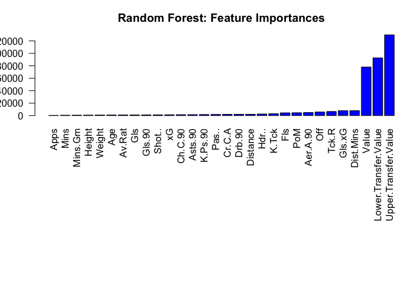

# Random Forest

Since the data has been cleaned, it can now be used to create the
models.

``` r
# Load libraries
library(caret)
```

    ## Loading required package: ggplot2

    ## Loading required package: lattice

``` r
library(randomForest)
```

    ## randomForest 4.7-1.1

    ## Type rfNews() to see new features/changes/bug fixes.

    ## 
    ## Attaching package: 'randomForest'

    ## The following object is masked from 'package:ggplot2':
    ## 
    ##     margin

``` r
library(MASS)

# Load helpers
source("./../helpers/helper.R")
```

## Import data

To evaluate the model, there should be a set of which the model has not
seen and for which the labels are known. Hence, it is necessary to split
the data into training and testing set.

``` r
# Read training and testing data
train <- read.csv("./../data/regression_data/intermediates/train.csv")
test <- read.csv("./../data/regression_data/intermediates/test.csv")
```

## Model Training

The model is first trained on the training data and then evaluated on
testing data.

``` r
# Model training
rf.model <- randomForest(CA~., data=train)
```

``` r
rf.model
```

    ## 
    ## Call:
    ##  randomForest(formula = CA ~ ., data = train) 
    ##                Type of random forest: regression
    ##                      Number of trees: 500
    ## No. of variables tried at each split: 10
    ## 
    ##           Mean of squared residuals: 63.04205
    ##                     % Var explained: 84.86

``` r
summary(rf.model)
```

    ##                 Length Class  Mode     
    ## call              3    -none- call     
    ## type              1    -none- character
    ## predicted       898    -none- numeric  
    ## mse             500    -none- numeric  
    ## rsq             500    -none- numeric  
    ## oob.times       898    -none- numeric  
    ## importance       30    -none- numeric  
    ## importanceSD      0    -none- NULL     
    ## localImportance   0    -none- NULL     
    ## proximity         0    -none- NULL     
    ## ntree             1    -none- numeric  
    ## mtry              1    -none- numeric  
    ## forest           11    -none- list     
    ## coefs             0    -none- NULL     
    ## y               898    -none- numeric  
    ## test              0    -none- NULL     
    ## inbag             0    -none- NULL     
    ## terms             3    terms  call

## Model Validation

``` r
# Predict the samples from test data using the model
result <- predict(rf.model, test)

# Print the RMSE and MAE
cat(paste("RMSE: ", RMSE(result, test$CA), "\n", "MSE: ", RMSE(result, test$CA)^2, "\n", "MAE: ", MAE(result, test$CA)))
```

    ## RMSE:  8.05210073976681 
    ##  MSE:  64.8363263233532 
    ##  MAE:  6.144944245142

``` r
# Plot feature importance
varImp.df <- data.frame(varImp(rf.model))
varImp.df$Overall <- varImp.df[order(varImp.df$Overall, decreasing = FALSE),]
par(mar=c(15,3,3,0))
barplot(varImp.df$Overall, names.arg=rownames(varImp.df), las=2, col="blue", main="Random Forest: Feature Importances")
```

<!-- -->

``` r
# Save the results
save.reg.result(RMSE(result, test$CA), MAE(result, test$CA), "Random Forest Regression")
```

## Prediction with Unknown Data

``` r
# Load the data
unk <- read.csv("./../data/regression_data/intermediates/unknown_data.csv")
```

    ## Warning in read.table(file = file, header = header, sep = sep, quote = quote, :
    ## incomplete final line found by readTableHeader on './../data/regression_data/
    ## intermediates/unknown_data.csv'

``` r
dim(unk)
```

    ## [1]  1 30

``` r
# Predict using the built model
prediction <- predict(rf.model, unk)
prediction
```

    ##        1 
    ## 99.02373
